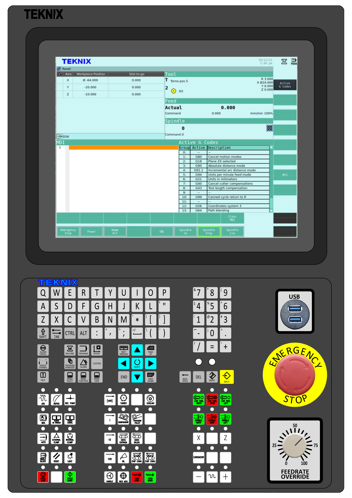

Bienvenidos al Manual de Usuario del Control Numérico de Teknix !
=================================================================

| En esta documentación podrá encontrar las referencias para el uso del control numérico **Teknix CNC**.
| El control Teknix CNC posee las siguientes características:

* Interpretador de Instrucciones
* Vizualización
* Gestor de Herramientas
* Editor de Programas
* Configuración de Alarmas

Para conocer sobre la definición de la geometría vea :doc:`geomFundamentals`. La sección :doc:`machineFundamentals` muestra algunas cuestiones generales sobre las máquinas CNC.
Para conocer sobre el uso de los comandos CNC vea :doc:`cncFundamentals`. Para conocer sobre el uso de las pantallas del usuario vea :doc:`humanMachineInterface`.
La sección :doc:`latheUserInfo` muestra algunas consideraciones a tener en cuenta para
tornos. La sección :doc:`toolCompensation` describe las consideraciones para tener en cuenta las dimensiones de las herramientas.

   
   Control Numérico Teknix.

Contenido
---------

.. toctree::

   geomFundamentals
   machineFundamentals
   cncFundamentals
   humanMachineInterface
   latheUserInfo
   toolCompensation
