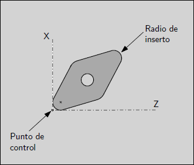
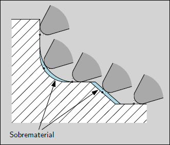

Torneado - Información de Usuario
#################################

.. _refLatheToolOrientation:

Orientación de Herramientas
---------------------------

Para que el controlador pueda implementar la corrección por decalaje de herramienta en un torno es necesario especificar la orientación 
del filo de la herramienta. A su vez se deben definir el ángulo frontal y el ángulo trasero de los filos, los que se miden en sentido horario 
empezando desde la dirección positiva del eje Z.

Para más información sobre la numeración de las orientaciones ver la sección sobre :ref:`Filos de Herramientas <refLatheCutter>`.

Puesta a punto de Decalajes
-----------------------------

Para poner a punto el decalaje de una herramienta es posible utilizar el siguiente procedimiento en el que se mecaniza una pieza y se mide la misma.
Es importante antes de realizar estos procedimientos asegurarse de que el decalaje de origen *G54/G55/..* esté en cero en todos los ejes.
Por ejemplo se puede ejecutar el comando *G10 L2 P1 X0 Y0 Z0* para poner en cero los decalajes del sistema de coordenadas *G54*.

**Largo de herramienta en X**

   * Realizar el cambio a la herramienta que se quiere poner a punto y cancelar la compensación de largo de herramienta, por ejemplo *T1 M6 G49*
   * Mecanizar una pieza para darle forma cilíndrica y medir su diámetro, supongamos que el diámetro es *D = 31.22 mm*.
   * Realizar la resta de la posición actual en *X_actual* (supongamos *X_actual = 89.56 mm*) menos el diámetro *D*, es decir *L = X_actual - Diam = 89.56 - 31.22 = 58.34 mm*
   * Grabar el largo de herramienta en la dirección X con el comando *G10 L1 P1 X58.34* 

**Largo de herramienta en Z**

   * Realizar el cambio a la herramienta que se quiere poner a punto y cancelar la compensación de largo de herramienta, por ejemplo *T1 M6 G49*
   * Mecanizar el frente de una pieza.
   * Realizar la resta de la posición actual en *Z_actual* (supongamos *Z_actual = 156.43 mm*) menos el valor deseado de *Z_deseado* (supongamos *40.0 mm* ), es decir *L = Z_actual - Z_deseado = 156.43 - 40.0 = 116.43 mm*
   * Grabar el largo de herramienta en la dirección Z con el comando *G10 L1 P1 Z116.43* 

.. _refLatheSpindleSyncMode:

Movimiento Sincronizado de Husillo
----------------------------------

El movimiento sincronizado de husillo requiere un encoder de cuadratura con un pulso de índice por vuelta. 

**Roscado**

El comando *G67* para ciclo de roscado puede utilizarse para roscado interno o externo. Para más información ver la sección :ref:`G76 <refG76>`.

**Velocidad superficial constante**

El modo de velocidad superficial constante utiliza la posición X de la herramienta para calcular la velocidad del husillo a los efectos de que 
la velocidad de corte de la herramienta sea la indicada. Opcinalmente se puede utilizar una velocidad máxima que limite la velocidad del husillo.
Esta opción es útil cuando la herramienta se ubica en una posición X cercana a 0, lo que hace que la velocidad del husillo para mantener la velocidad
superficial sea muy grande. Para más información ver la sección :ref:`G96 <refG96>`.

**Avance por revolución**

En el modo de avance por revolución el eje Z se moverá una cantidad *F* de unidades por revolución del husillo. Este modo no está pensado para realizar
roscas, para eso utilice el comando *G76*. Para más información ver la sección :ref:`G95 <refG93>`.

.. _refLatheArcs:

Arcos de Círculos
-----------------

Realizar los cálculo para definir los arcos de círculo puede ser complejo cuando se tiene que tener en cuenta el modo radial o diamentral
en tornos, además de la orientación del sistema de coordenadas de la máquina y los modos de distancia absoluta o relativa para las
coordenadas del punto final por un lado y del centro del arco por el otro. En un torno se debe definir el plano de trabajo con G18 
en el preámbulo ya que incluso en los tornos el plano de trabajo por defecto es G17. Los arcos de círculo en G18, plano XZ, utilizan los
parámetros I (eje X) y K (eje Z) para definir el centro del arco.

**Arcos y diseño del torno**

El diseño de torno típico tiene el husillo a la izquierda del operador y la herramientas en el lado del operador. 
Este diseño típico tiene la siguiente disposición:

   * El extremo positivo del eje +Z hacia la derecha, hacia afuera del husillo.
   * El extremo positivo del eje +X hacia atrás, es decir en contra de la posición del operador.
   * El extremo positivo del eje +Y apuntando hacia arriba.

El sentido de los arcos *G2/G3* se basan en la dirección del eje alrededor el cual giran. En el caso de los tornos es respecto al eje Y que apunta hacia arriba.
Por lo que mirando desde arriba el comando *G2* hace que la herramienta describa un arco de círculo en el sentido horario y el comando *G3* en el sentido antihorario.

**Modo radial y diametral**

Cuando se calculan los arcos en modo radial solo debe recordar el sentido de rotación según la convención del torno en cuestión.

Cuando se calculan los arcos en modo diametral la coordenada X del punto final es el diámetro y la posición del centro de arco (I) es el radio,
incluso si está activo el modo diametral.

.. _refLatheToolPath:

Trayectoria de Herramientas
---------------------------

**Punto de control**

El punto de control es el punto que sigue la trayectoria especificada cunado la compensación de herramienta está desactivada. El punto de control en las herramientas
de torno se especifica en la intersección de las líneas tangentes al filo en dirección de los ejes X y Z.

   
   Punto de control de herramienta

Cuando se mecaniza el frente de una pieza o un diámetro, la trayectoria sigue la dirección de los ejes X y Z, por que lo el punto de control sigue la misma línea que 
los filos de la herramienta. Sin embargo, cunado se mecaniza una parte cónica o un arco de círculo, el punto de control (sin compensación de herramienta) no coincide 
con el filo del inserto de la herramienta y por ende se produce un sobrematerial respecto al contorno especificado con los comandos de movimiento.

   
   Contorno sin compensación de herramienta

**Utilizando la compensación de herramienta**

Cuando se activa la compensación de herramientas el control tiene en cuenta el radio del inserto para coorregir la posición de los ejes y lograr el contorno 
especificado por los comandos. Cabe aclarar que el radio mínimo de un arco de círculo cóncavo (como el de la figura de arriba) que se puede mecanizar no puede
ser menor que el radio de la herramienta. Además el ángulo de ataque no puede superar el ángulo frontal o trasero de la herramienta. 
