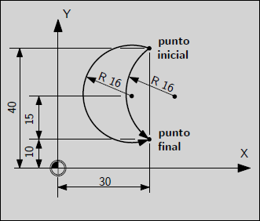

Fundamentos de CNC
##################

En esta sección se describen los elementos del lenguage de código G, su estructura, comandos y expresiones.

.. _estrCNC:

Estructura del Código G
=======================

| El lenguaje de código G está conformado por líneas de código, también llamadas bloques. Cada línea puede incluir comandos para realizar varias cosas. 
| Las líneas pueden ser agrupadas en un archivo que define una rutina o pueden ser agrupadas para formar subrutinas o funciones. 
| Una línea típica de código consiste en una numeración opcional al comienzo seguida de uno o más términos, también llamados palabras. Un término consiste en una letra
  seguida de un número o algo que se evalúa y se convierte en un número. Ese término puede dar un comando o proveer un argumento a un comando. 
| Por ejemplo G1 X30 es una línea de código con dos términos. G1 es un comando que solicita el movimiento en línea recta a la velocidad programada a determinado punto, y X30 provee un 
  argumento que especifica que la coordenada X debe ser de 30 en el punto al final del movimiento. 
| La mayoría de los comandos empieza con la letra G o con la letra M, que hacen referencia a comandos Generales y Misceláneos respectivamente. 
| Los programas no poseen un indicador de inicio y fin. Un programa puede estar en un solo archivo o puede estar repartido
  en varios archivos. Se pueden utilizar los comandos M2 o M30 opcionalmente para indicar el fin de un programas. 

Formato
-------

Una línea de comando está compuesta de los siguientes elementos, en orden, con un límite de 256 caracteres:

* Un caracter opcional, la barra ( / ) que indica bloques de comentarios. 
* Un número de línea que es opcional. 
* Un número variable de términos, parámetros y comentarios. 
* Un marcador de fin de línea. 

| Cualquier término que no esté explícitamente permitido producirá un error. 
| Los espacios y tabulaciones están permitidos en cualquier parte del código y no modifican el significado del mismo,
  esto hace que algunos aspectos extraños sean correctos, por ejemplo: 
| G0X +12. 5Y70 es equivalente a G0 x+12.5 Y70 y a G0 X 12.5 Y 70. 
| Las líneas vacías también están permitidas, no tienen efecto en el código. 
| El uso de maýusculas o minúsculas es indiferente y no cambia el significado. 
| El número de línea se forma con la letra N seguido de un número entero, opcionalmente seguido de un punto y otro número entero. 
  Por ejemplo, N103 y N103.12 son números de línea válidos. Pueden estar repetidos y estar definidos en orden creciente o no, aunque 
  la práctica usual es evitarlos o en caso de utilizarlos definirlos en orden creciente. 
| Los términos están formados por cualquier letra de las que se muestarn en la siguente tabla: 

+-------+-----------------------------------------------------------------------+
| Letra |  Significado                                                          |
+=======+=======================================================================+
|   A   | Eje A de máquina                                                      |
+-------+-----------------------------------------------------------------------+
|   B   | Eje B de máquina                                                      |
+-------+-----------------------------------------------------------------------+
|   C   | Eje C de máquina                                                      |
+-------+-----------------------------------------------------------------------+
|   D   | Radio de compensación de herramienta                                  |
+-------+-----------------------------------------------------------------------+
|   F   | Velocidad de avance                                                   |
+-------+-----------------------------------------------------------------------+
|   G   | Función general (tabla de grupos modales)                             |
+-------+-----------------------------------------------------------------------+
|   H   | Índice de longitud de herramienta                                     |
+-------+-----------------------------------------------------------------------+
|   I   | Distancia relativa en X para círculos y ciclos cerrados G87           |
+-------+-----------------------------------------------------------------------+
|   J   | Distancia relativa en Y para círculos y ciclos cerrados G87           |
+-------+-----------------------------------------------------------------------+
|   K   | Distancia relativa en Z para círculos y ciclos cerrados G87           |
|       |                                                                       |
|       | Fracción de movimiento de husillo para movimientos sincronizados G33  |
+-------+-----------------------------------------------------------------------+
|   L   | Parámetros genericos para G10, M66 y otros                            |
+-------+-----------------------------------------------------------------------+
|   M   | Misceláneos                                                           |
+-------+-----------------------------------------------------------------------+
|   N   | Número de bloque                                                      |
+-------+-----------------------------------------------------------------------+
|   P   | Tiempo de espera para ciclos con G4                                   |
|       | Código usado con G10                                                  |
+-------+-----------------------------------------------------------------------+
|   Q   | Incremento de velocidad de avance en ciclos G73, G83                  |
+-------+-----------------------------------------------------------------------+
|   R   | Radio de círculo o plano de ciclo cerrado                             |
+-------+-----------------------------------------------------------------------+
|   S   | Velocidad de Husillo                                                  |
+-------+-----------------------------------------------------------------------+
|   T   | Selección de herramienta                                              |
+-------+-----------------------------------------------------------------------+
|   U   | Eje U de máquina                                                      |
+-------+-----------------------------------------------------------------------+
|   V   | Eje V de máquina                                                      |
+-------+-----------------------------------------------------------------------+
|   W   | Eje W de máquina                                                      |
+-------+-----------------------------------------------------------------------+
|   X   | Eje X de máquina                                                      |
+-------+-----------------------------------------------------------------------+
|   Y   | Eje Y de máquina                                                      |
+-------+-----------------------------------------------------------------------+
|   Z   | Eje Z de máquina                                                      |
+-------+-----------------------------------------------------------------------+

Algunas de estas letras (I,J,K,L,P,R) pueden tener diferentes significados de acuerdo al contexto. Las letras que se refieren a nombres de ejes no son válidos en una
máquina que no tiene ese eje.

Números
-------

| Las siguientes reglas se aplican para los números (explícitos), en las que un dígito es un caracter del 0 al 9.
| Un número consiste de un signo + o signo - que es opcional, seguido de ningún a muchos dígitos, luego puede tener 
  un punto decimal seguido de ningún a muchos dígitos, siempre y cuando el número tenga al menos un dígito en alguna parte.
| Hay dos tipos de números, decimales y enteros, que se diferencian por poseer o no un punto decimal.
| Los números pueden tener un número variable de dígitos, siempre que respeten el límite del largo de línea máximo, aunque
  se utilizarán alrededor de 17 cifras significativas.
| Se asume que un número sin signo es positivo.

Secuencia
---------

A los efectos de mantener el formato de los bloques lo más claros posibles es recomendable seguir el siguiente orden:

+-------------+------------------------------------------------------------------------+
| Término     | Significado                                                            |
+=============+========================================================================+
| N           | Número de bloque                                                       |
+-------------+------------------------------------------------------------------------+
| G           | Función de preparación                                                 |
+-------------+------------------------------------------------------------------------+
| X, Y, Z     | Datos de posición                                                      |
+-------------+------------------------------------------------------------------------+
| F           | Velocidad de avance                                                    |
+-------------+------------------------------------------------------------------------+
| S           | Velocidad de husillo                                                   |
+-------------+------------------------------------------------------------------------+
| T           | Herramienta                                                            |
+-------------+------------------------------------------------------------------------+
| D           | Corrección de herramienta                                              |
+-------------+------------------------------------------------------------------------+
| M           | Función miscelánea                                                     |
+-------------+------------------------------------------------------------------------+
| H           | Función auxiliar                                                       |
+-------------+------------------------------------------------------------------------+

.. admonition:: Nota

   Ciertos términos pueden usarse repetidamente en un bloque (ej. G..., M..., H... )

Comportamiento Modal
--------------------

Muchos de los comandos causan un cambio del modo en el cotrolador, ese modo queda activado hasta que otro comando lo cambia explícitamente o implícitamente. Éstos comandos son
llamados comandos modales. Por ejemplo, si se prende el bombeo de refrigerante, permanece prendido hasta que explícitamente se lo apaga. Los comandos de movimiento también son 
modales. Si se define un comando G1 (movimiento lineal) en una línea, por ejemplo, será ejecutado nuevamente en las líneas siguientes si uno o más términos modifican posiciones 
de ejes, a no ser que se defina un comando en las líneas siguientes que explícitamente cancele el movimiento.

Los comandos no modales tienen efecto sólo en la línea en la que están definidos. Por ejemplo, G4 (espera) es no modal.

Grupos Modales
--------------

Los comandos modales está clasificados en grupos modales, en los que sólo un comando del grupo puede estar activo en determinado momento. En general los grupos modales contienen 
comandos para los que es lógicamente imposible que dos elementos tengan efecto al mismo tiempo, como por ejemplo medidas en milímetros y medidas en pulgadas. Una máquina puede
tener activos varios modos al mismo tiempo, con un modo de cada grupo modal aplicados. Los grupos modales se muestran en la siguiente tabla:

Tabla de Grupos Modales para códigos G

+---------------------------------------------------+--------------------------------------------------------------+
| Tipo de Grupo Modal                               | Términos del Grupo                                           |
+===================================================+==============================================================+
| Códigos no modales (Grupo 0)                      | G4, G10, G28, G30, G52, G53, G92, G92.1, G92.2, G92.3        |
+---------------------------------------------------+--------------------------------------------------------------+
| Movimiento (Grupo 1)                              | G0, G1, G2, G3, G33, G38.n, G73, G76, G80, G81               |
|                                                   | G82, G83, G84, G85, G86, G87, G88, G89                       |
+---------------------------------------------------+--------------------------------------------------------------+
| Selección de plano (Grupo 2)                      | G17, G18, G19, G17.1, G18.1, G19.1                           |
+---------------------------------------------------+--------------------------------------------------------------+
| Modo de distancia (Grupo 3)                       | G90, G91                                                     |
+---------------------------------------------------+--------------------------------------------------------------+
| Modo de distancia de círculos IJK (Grupo 4)       | G90.1, G91.1                                                 |
+---------------------------------------------------+--------------------------------------------------------------+
| Modo de velocidad de avance (Grupo 5)             | G93, G94, G95                                                |
+---------------------------------------------------+--------------------------------------------------------------+
| Unidades (Grupo 6)                                | G20, G21                                                     |
+---------------------------------------------------+--------------------------------------------------------------+
| Compensación de radio de herramienta (Grupo 7)    | G40, G41, G42, G41.1, G42.1                                  |
+---------------------------------------------------+--------------------------------------------------------------+
| Largo de herramienta (Grupo 8)                    | G43, G43.1, G49                                              |
+---------------------------------------------------+--------------------------------------------------------------+
| Modo de retorno de ciclos cerrados (Grupo 10)     | G98, G99                                                     |
+---------------------------------------------------+--------------------------------------------------------------+
| Sistemas de coordenadas (Grupo 12)                | G54, G55, G56, G57, G58, G59, G59.1, G59.2, G59.3            |
+---------------------------------------------------+--------------------------------------------------------------+
| Modo de control (Grupo 13)                        | G61, G61.1, G64                                              |
+---------------------------------------------------+--------------------------------------------------------------+
| Velocidad de husillo (Grupo 14)                   | G96, G97                                                     |
+---------------------------------------------------+--------------------------------------------------------------+
| Modo de diametral de tornos (Grupo 15)            | G7, G8                                                       |
+---------------------------------------------------+--------------------------------------------------------------+

Tabla de Grupos Modales para códigos M

+---------------------------------------------------+--------------------------------------------------------------+
| Tipo de Grupo Modal                               | Términos del Grupo                                           |
+===================================================+==============================================================+
| Parada (Grupo 4)                                  | M0, M1, M2, M30, M60                                         |
+---------------------------------------------------+--------------------------------------------------------------+
| Husillo (Grupo 7)                                 | M3, M4, M5                                                   |
+---------------------------------------------------+--------------------------------------------------------------+
| Refrigerante (Grupo 8)                            | (M7 M8 pueden estar ambos activos), M9                       |
+---------------------------------------------------+--------------------------------------------------------------+
| Control de override (Grupo 9)                     | M48, M49                                                     |
+---------------------------------------------------+--------------------------------------------------------------+
| Grupo definido por el usuario (Grupo 10)          | M100 - M199                                                  |
+---------------------------------------------------+--------------------------------------------------------------+

Para varios de los modos, cuando una máquina está lista para aceptar comandos, un elemento del grupo debe estar en efecto. Hay configuraciones por defecto para estos modos.
Cuando la máquina se prende o se reinicializa, los valores por defecto se activan.
El grupo 1 es el grupo de movimiento. Un comando de este grupo debe estar siempre en efecto, el que es llamado modo de movimiento vigente.
Es un error escribir código G del grupo 1 y código G del grupo 0 en la misma línea si ambos hacen referencia a ejes. Si hay un término del grupo 1 implícitamente en efecto 
en una línea (al ser definido en alguna línea anterior) y el comando del grupo 0 que hace referencia al eje en la misma línea, la actividad del código G del grupo 1 se suspende
para esa línea. 

.. _refComentarios:

Comentarios
-----------

Es posible agregar comentarios a las líneas del código G que ayudan a esclarecer la intención del programador. Los comentarios pueden ser escritos en la línea mediante el uso de 
los paréntesis () o estar al final de la línea utilizando el signo de punto coma ; .
Los comentarios pueden utilizarse entre los términos pero no entre un término y su correspondiente parámetro.
Por ejemplo S0, S100 (determinar velocidad) F200 (velocidad) es válido, pero S(velocidad)100 F(velocidad) 200 no es correcto.

Hay algunos comentarios activos que **parecen** comentarios pero causan alguna acción, como (debug,..) o (print,..). Si hay varios comentarios en una línea, sólo el último comentario
será interpretado según estas reglas. Por lo tanto un comentario normal seguido de un comentario activo tendrá el efecto de desactivar el comentario activo. For ejemplo (foo)(debug,#1)
mostrará el valor del parámetro #1, sin embargo (debug,#1)(foo) no lo hará.

Un comentario definido por un punto coma es por definición el último comentarioen esa línea y será interpretado con la sintáxis de comentarios activos.

Mensajes
--------

Es posible mostrar un mensaje al operador desde el código con la función MSG(), por ejemplo MSG('Programa en ejecución') mostrará 'Programa en ejecución' al usuario. Si se requiere
una confirmación del operador para avanzar se puede utilizar el comando POPUP() que mostará el mensaje al operador en una ventana emergente y bloqueará la ejecución del programa
hasta que el operador confirme.

Parámetros
----------

| El lenguage CNC permite el uso de parámetros, lo que en otros lenguajes de programación se conoce como variables. Existen varios tipos de parámetros que tienen diferentes propósitos,
  que se describen a continuación. El único valor soportado como parámetros son los números de punto flotante, no hay parámetros con valores lógicos, de texto o enteros en el código G.
| Sin embargo, se pueden utilizar expresiones con operadores lógicos (AND, OR, XOR) y operadores de comparación (EQ, NE, GT, GE, LT, LE) y operadores que soportan aritmética de enteros
  como MOD, ROUND, FUP y FIX.
| Los parámetros difieren en su sintáxis, ámbito (scope), comportamiento cuando no están inicializados, modo, persistencia y propósito de uso.

**Sintáxis**

   Hay tres tipos de apariencia sintáctica:
   
   * Parámetro Numerad0  #4711
   * Parámetro por nombre, local  #<valorlocal>
   * Parámetro por nombre, global  #<_valorglobal>

**Ámbito (Scope)**

Los parámetros o variables son normalmente creadas y desechadas en la ejecución del código. El ámbito o scope de un parámetro es la parte del código donde un parámetro existe
la variable, éste puede ser Global, o Local dentro de una subrutina. Los parámetros creados dentro de una subrutina tienen scope o ámbito local, es decir que la variable existen dentro
de la subrutina pero la rutina que llama a esa subrutina no puede acceder a la misma. En cambio, las variables globales pueden ser accesibles en todo el código.

**Inicialización**

| Los parámetros o variables globales no inicializadas y parámetros de subrutina no usados dan el valor 0 cuando se los usa en una expresión.
| Los parámetros por nombre no inicializados dan error al ser usados en una expresión.

**Modo**

La mayoría de los parámetros son de lectura y escritura, sin embargo existen algunos parámetros predefinidos que no deben cambiar que son sólo de escritura. 
Pueden ser utilizados en una expresión pero no se les puede asignar un valor.

**Persistencia**

Al apagar el control numérico los parámetros volátiles pierden su valor. Todos los parámetros salvo los parámetros numerados son volátiles. Los parámetros persistentes
se guardan en un archivo con formato .var y sus valores son restaurados a sus valores pervios cuando el control se reinicia. Los parámetros volátiles son reiniciados a 
valor cero.

**Propósito**

* Parámetros de usuario
   | Parámetros numerados en el rango de 31 a 5000 y parámetros por nombre globales y locales, salvo los predefinidos.
   | Éstos están disponibles para propósitos generales, como guardar valores de punto flotante, resultados intermedios, etc. en la ejecución de u 
     programa.
   | Son de lectura y escritura.
* Parámetros de subrutinas
   Se utilizan para guardar los valores de los parámetros vigentes para pasarlos a un subrutina.
* Parámetros numerados
   La mayoría se utilizan para acceder a los decalajes de los sistemas de coordenadas.
* Parámetros de sistema 
   Usados para acceder a la versión del sistema que se utiliza. Son de solo lectura.

Expresiones
-----------

Las expresiones están formadas por una serie de caracteres que empiezan con un corchete izquierdo ( [ ) y terminan con un corchete derecho ( ] ). En el medio tiene números,
parámetros, operaciones matemáticas y/u otras expresiones. Las expresiones son evaluadas a un número. Las expresiones son evaluadas cuando se lee la línea, antes de la ejecución.
Un ejemplo es la expresión [1 + acos[0] - [#3 ** [4.0/2]]].

**Comparación y operadores lógicos**

+--------------------+--------------------------+
| Operador           | Significado              |
+====================+==========================+
| == o EQ            | Igual a                  |
+--------------------+--------------------------+
| <> O NE            | Desigual a               |
+--------------------+--------------------------+
| > o GE             | Mayor o igual a          |
+--------------------+--------------------------+
| < o GT             | Mayor a                  |
+--------------------+--------------------------+
| < o LE             | Menor o igual a          |
+--------------------+--------------------------+
| < o LT             | Menor a                  |
+--------------------+--------------------------+
| & o AND            | Y                        |
+--------------------+--------------------------+
| \| o OR            | O (inclusivo)            |
+--------------------+--------------------------+
| \^ o XOR           | O (exclusivo)            |
+--------------------+--------------------------+
| ! o NOT            | Negación                 |
+--------------------+--------------------------+

**Precedencia**

Los operadores están divididos en varios grupos de acuerdo a su precedencia. Si se definen juntas varias operaciones de diferente precedencia en una expresión 
(por ejemplo 2.0 / 3 * 1.5 - 5.5 / 11.0 ) se ejecutan las operaciones con mayor precedencia primero y luego las de menor precedencia. Si una expresión contiene 7
más de una operación con el mismo nivel de precedencia, se ejecuta de izquierda a derecha. Por ende, el ejemplo es equivalente a  [[[2.0/3]*1.5]-[5.5/11.0]], lo
que es equivalente a [1.0-0.5] que da como resultado 0.5.
Las operaciones lógicas y de módulo son ejecutadas para cualquier número real, no solo enteros. El número cero es quivalente al falso lógico, y cualquier número no 
nulo es equivalente al verdadero lógico.

+----------------------+-------------+
| Grupos de operadores | Precedencia |
+======================+=============+
| \**                  | Mayor       |
+----------------------+-------------+
| \* \/ MOD            |             |
+----------------------+-------------+
| \+ \-                |             |
+----------------------+-------------+
| EQ NE GT GE LT LE    |             |
+----------------------+-------------+
| AND OR XOR NOT       | Menor       |
+----------------------+-------------+

**Igualdades de punto flotante**

El lenguage permite solo valores de punto flotante, por lo que la presición en la representación de números reales es acotada. Es por esto que la igualdad o desigualdad de
dos valores de punto flotante es inherentemente problemática. El interpretador resuelve este problema al considerar que dos valores son iguales si la diferencia entre ambos 
es menor a 0.0001. Este valor se define como una variable persistente.

**Funciones**

+-------------------+-----------------------------------------------------------+
|       Función     |         Resultado                                         |
+===================+===========================================================+
|  ATAN[arg]/[arg]  | Inversa de la tangente en los cuatro cuadrantes           |
+-------------------+-----------------------------------------------------------+
|      ABS[arg]     | Valor absoluto                                            |
+-------------------+-----------------------------------------------------------+
|     ACOS[arg]     | Inversa del coseno                                        |
+-------------------+-----------------------------------------------------------+
|     ASIN[arg]     | Inversa del seno                                          |
+-------------------+-----------------------------------------------------------+
|      COS[arg]     | Coseno                                                    |
+-------------------+-----------------------------------------------------------+
|      EXP[arg]     | Número e elevando a la potencia dada                      |
+-------------------+-----------------------------------------------------------+
|      FIX[arg]     | Truncamiento a próximo entero hacia abajo                 |
+-------------------+-----------------------------------------------------------+
|    ROUND[arg]     | Truncamiento a entero más próximo                         |
+-------------------+-----------------------------------------------------------+
|       LN[arg]     | Logaritmo natural                                         |
+-------------------+-----------------------------------------------------------+
|      SIN[arg]     | Seno                                                      |
+-------------------+-----------------------------------------------------------+
|     SQRT[arg]     | Raíz cuadrada                                             |
+-------------------+-----------------------------------------------------------+
|      TAN[arg]     | Tangente                                                  |
+-------------------+-----------------------------------------------------------+
|    EXIST[arg]     | Existencia de un parámetro numerado                       |
+-------------------+-----------------------------------------------------------+

.. _practicasCNC:

Buenas prácticas
----------------

* Utilice una presición apropiada
   Use al menos 3 dígitos luego del punto decimal cuando las unidades están en milímetros y por los menos 4 cuando están en pulgadas.

* Utilice el espaciado consistentemente
   El código G es más legible cuando por lo menos hay un espacio antes de cada término. Mientras que se permiten espacios en el medio de los números, no hay razón para hacerlo.

* Use definición del centro de arcos
   La definición del centro de arcos de círculos por medio de coordenadas (I,J,K en vez de R) se comporta de manera más consistente que los arcos definidos por su radio, partiularmente
   para ángulos cercanos a 180 o 360 grados.

* Use preambulos para definir los grupos modales
   La correcta ejecución del programa generalmente depende de la configuración de los modos. Asegúrese de que al principio de su programa estén definidos, ya que los modos pueden 
   ser acarreados de programas previos y desde comandos de la interfaz. 

Ejemplo de preambulo de modos::

   G17 G20 G40 G49 G54 G80 G90 G94

   G17 define el plano de trabajo XY
   G20 selecciona pulgadas
   G40 cancela la compensación diametral
   G49 cancela el decalaje por largo de herramienta
   G54 para utilizar el sistema de coordenadas 1
   G80 cancela los ciclos cerrados
   G90 define coordenadas absolutas 
   G94 define avance en distancia/minutos.

* No defina demasiadas cosas en una línea
   Si bien la sección :ref:`ordenEjecucionCNC` se muestra para referencia, no tenga en cuenta lo indicado en esta sección para escribir todo en una línea. 
   Es más claro y legible escribir lo mismo en varias líneas separadas.

* No defina y use un parámetro en el misma línea
   No defina y use un parámetro en el misma línea, a pesar de que la semántica esté bien utilizada. Actualizar el valor de una variable usando #1=[#1+#2] está permitido.

* No use numeración de líneas
   El uso de los números de línea no ofrece ventaja alguna. Cuando se reportan números de líneas en los mensajes de error se hace referencia al número de línea del archivo, 
   no a los números de línea definidos por el código G.

Mensajes de Errores Comunes
---------------------------

* Código G fuera de ámbito
   Se utilizó un código G mayor a G99, el rango de códigos G es de 0 a 99. Además no todos los números entre 0 y 99 son códigos válidos.

* Código G no reconocido
   Se ha utilizado un código G que no forma parte del lenguaje.

* I,J,K sin Gx a utilizar
   Los términos I,J,K deben ser utilizados en la misma línea que el código G.
   
* No se puede utilizar un valor de posición de eje sin un código G que lo utilice
   Los valores de posición de ejes no se pueden especificar en una línea sin un código G modal que esté vigente o bien un código G en la misma línea.

* Archivo finalizado sin signo de terminación ( % ) o programa terminado
   Todo código G debe tener un M2 o M30 en la última línea o estar limitado por un signo de porcentaje %.

.. _tablaCodigosG:

Tabla de Referencia - Códigos G
===============================

En esta sección se detallan los códigos G y su forma de uso. En la descripción se utiliza el guión (-) para denotar un valor real y 
los signos (<>) para denotar un item opcional.
Si se utiliza la siguiente expresión L- significa que en el código se debe utilizar por ejemplo L20 y se hará referencia a ese valor 
como el *valor L*. De igual manera se hace con cualquier otra letra.
En estos prototipos de código G la palabra *ejes* se utiliza para cualquier eje que esté en su configuración.
Un valor opcionalserá escrito de esta forma *<L->*.
Un valor real podrá ser:

* Un número explícito, *4*
* Una expresión, *[2+4]*
* Un parámetro, *#88*
* Una función escalar, *acos[0]*

En la mayoría de los casos, si se utiliza la palabra *eje* (cualquiera o todos de *X Y Z A B C U V W*, especifica un punto de destino.

Las posiciones de ejes están en sus sistemas de coordenadas activos,  a no ser que explícitamente se describa que hacen referencia al sistema de
coordenadas absolutas.

En donde la posición de un eje es opcional, cualquier valor omitido significa que el eje retiene su posición original.

Todos los items que en los prototipos de código G no sea descripto comomopcional es una valor requerido.

Los valores de las siguientes letras son dados frecuentemente como números. A no ser que se describa otra cosa, los números
explícitos pueden ser valores reales. Por ejemplo, *G10 L2* puede ser equivalente a *G[2*5]L[1+1]*. Si el valor del parámetro
100 fuera 2, *G10 L#100* tendría el mismo significado.

Si L- está escrito en la forma de prototipo el signo - frecuentemente está referido al *número L*, y así para cualquier otra letra.

+-------------------------------+--------------------------------------------------------------------------+
|       Comando                 | Descripción                                                              |
+===============================+==========================================================================+
|  :ref:`G0 <refG0>`            | Movimiento coordinado rápido                                             |
+-------------------------------+--------------------------------------------------------------------------+
|  :ref:`G1 <refG1>`            | Movimiento coordinado con velocidad de avance                            |
+-------------------------------+--------------------------------------------------------------------------+
|  :ref:`G2 G3 <refG2>`         | Movimiento de Arco de Círculo o Helicoidal                               |
+-------------------------------+--------------------------------------------------------------------------+
|  :ref:`G4 <refG4>`            | Espera                                                                   |
+-------------------------------+--------------------------------------------------------------------------+
|  :ref:`G5 <refG5>`            | Spline Cúbico                                                            |
+-------------------------------+--------------------------------------------------------------------------+
|  :ref:`G5.1 <refG5.1>`        | Spline Cuadrático                                                        |
+-------------------------------+--------------------------------------------------------------------------+
|  :ref:`G7 <refG7>`            | Modo Diametral (para torneado)                                           |
+-------------------------------+--------------------------------------------------------------------------+
|  :ref:`G8 <refG8>`            | Modo Radial (para torneado)                                              |
+-------------------------------+--------------------------------------------------------------------------+
|  :ref:`G10 L1 <refG10L1>`     | Definición de Parámetros de Herramienta                                  |
+-------------------------------+--------------------------------------------------------------------------+
|  :ref:`G10 L2 <refG10L2>`     | Definición de de Sistema Coordinado                                      |
+-------------------------------+--------------------------------------------------------------------------+
| :ref:`G10 L10 <refG10L10>`    | Definición de Parámetros de Herramienta en Punto Actual                  |
+-------------------------------+--------------------------------------------------------------------------+
| :ref:`G10 L11 <refG10L11>`    | Definición de Parámetros de Herramienta en Punto Actual referido a G59.3 |
+-------------------------------+--------------------------------------------------------------------------+
| :ref:`G10 L20 <refG10L20>`    | Definición de de Sistema Coordinado                                      |
+-------------------------------+--------------------------------------------------------------------------+
| :ref:`G17-G19.1 <refG17>`     | Selección de Plano de Trabajo                                            |
+-------------------------------+--------------------------------------------------------------------------+
| :ref:`G20 G21 <refG20>`       | Selección de Unidades                                                    |
+-------------------------------+--------------------------------------------------------------------------+
| :ref:`G28 G28.1 <refG28>`     | Ir a posición Predeterminada                                             |
+-------------------------------+--------------------------------------------------------------------------+
| :ref:`G30 G30.1 <refG30>`     | Ir a posición Predeterminada                                             |
+-------------------------------+--------------------------------------------------------------------------+
| :ref:`G33 <refG33>`           | Movimiento Sincronizado de Husillo                                       |
+-------------------------------+--------------------------------------------------------------------------+
| :ref:`G33.1 <refG33.1>`       | Roscado Rígido                                                           |
+-------------------------------+--------------------------------------------------------------------------+
| :ref:`G38.n <refG38>`         | Sondeo                                                                   |
+-------------------------------+--------------------------------------------------------------------------+
| :ref:`G40 <refG40>`           | Compensación de Radio de Herramienta Desactivada                         |
+-------------------------------+--------------------------------------------------------------------------+
| :ref:`G41 G42 <refG41>`       | Compensación de Radio de Herramienta                                     |
+-------------------------------+--------------------------------------------------------------------------+
| :ref:`G41.1 G42.1 <refG41.1>` | Compensación Dinámica de Radio de Herramienta                            |
+-------------------------------+--------------------------------------------------------------------------+
| :ref:`G43 <refG43>`           | Compensación de Largo de Herramienta                                     |
+-------------------------------+--------------------------------------------------------------------------+
| :ref:`G43.1 <refG43.1>`       | Compensación Dinámica de Largo de Herramienta                            |
+-------------------------------+--------------------------------------------------------------------------+
| :ref:`G43.2 <refG43.2>`       | Compensación Adicional de Largo de Herramienta                           |
+-------------------------------+--------------------------------------------------------------------------+
| :ref:`G49 <refG49>`           | Cancelar Compensación de Largo de Herramienta                            |
+-------------------------------+--------------------------------------------------------------------------+
| :ref:`G52 <refG52>`           | Decalaje temporal del Sistema de Coordenadas Local                       |
+-------------------------------+--------------------------------------------------------------------------+
| :ref:`G53 <refG53>`           | Posición en Sistema de Coordenadas de Máquina                            |
+-------------------------------+--------------------------------------------------------------------------+
| :ref:`G54-G59.3 <refG54>`     | Selección de Sistema de Coordenadas Local                                |
+-------------------------------+--------------------------------------------------------------------------+
| :ref:`G61 <refG61>`           | Modo de Posicionamiento Exacto                                           |
+-------------------------------+--------------------------------------------------------------------------+
| :ref:`G61.1 <refG61.1>`       | Modo de Frenado en Posición Preciso                                      |
+-------------------------------+--------------------------------------------------------------------------+
| :ref:`G64 <refG64>`           | Suavizado de Trayectoria                                                 |
+-------------------------------+--------------------------------------------------------------------------+
| :ref:`G73 <refG73>`           | Ciclo de Perforado con Ruptura de Viruta                                 |
+-------------------------------+--------------------------------------------------------------------------+
| :ref:`G74 <refG74>`           | Ciclo de Roscado Izquierdo con Espera                                    |
+-------------------------------+--------------------------------------------------------------------------+
| :ref:`G76 <refG76>`           | Ciclo de Roscado de Varias Pasadas (Torneado)                            |
+-------------------------------+--------------------------------------------------------------------------+
| :ref:`G80 <refG80>`           | Cancelación de Ciclo Cerrado                                             |
+-------------------------------+--------------------------------------------------------------------------+
| :ref:`G81 <refG81>`           | Ciclo de Perforado                                                       |
+-------------------------------+--------------------------------------------------------------------------+
| :ref:`G82 <refG82>`           | Ciclo de Perforado con Espera                                            |
+-------------------------------+--------------------------------------------------------------------------+
| :ref:`G83 <refG83>`           | Ciclo de Perforado Profundo                                              |
+-------------------------------+--------------------------------------------------------------------------+
| :ref:`G84 <refG84>`           | Ciclo de Roscado Derecho con Espera                                      |
+-------------------------------+--------------------------------------------------------------------------+
| :ref:`G85 <refG85>`           | Ciclo de Perforado con Velocidad de Salida                               |
+-------------------------------+--------------------------------------------------------------------------+
| :ref:`G86 <refG86>`           | Ciclo de Perforado, Freno de Husillo y Velocidad Rápida de Salida        |
+-------------------------------+--------------------------------------------------------------------------+
| :ref:`G89 <refG89>`           | Ciclo de Perforado, Espera y Velocidad de Salida                         |
+-------------------------------+--------------------------------------------------------------------------+
| :ref:`G90 G91 <refG90>`       | Modo de Distancia Absoluta o Relativa                                    |
+-------------------------------+--------------------------------------------------------------------------+
| :ref:`G90.1 G91.1 <refG90.1>` | Modo de Distancia de Arcos Absoluta o Relativa                           |
+-------------------------------+--------------------------------------------------------------------------+
| :ref:`G92 <refG92>`           | Definir Posición de Sistema de Coordenadas en Punto Actual               |
+-------------------------------+--------------------------------------------------------------------------+
| :ref:`G92.1 G92.2 <refG92.1>` | Resetear Posición de Sistema de Coordenadas                              |
+-------------------------------+--------------------------------------------------------------------------+
| :ref:`G92.3 <refG92.3>`       | Restablecer Posición de Sistema de Coordenadas de G92                    |
+-------------------------------+--------------------------------------------------------------------------+
| :ref:`G93 G94 G95 <refG93>`   | Modo de Avance                                                           |
+-------------------------------+--------------------------------------------------------------------------+
| :ref:`G96 G97 <refG96>`       | Modo de Control de Husillo                                               |
+-------------------------------+--------------------------------------------------------------------------+
| :ref:`G98 G99 <refG98>`       | Nivel de Retorno de Ciclos Cerrados                                      |
+-------------------------------+--------------------------------------------------------------------------+

.. _refG0:

G0 Movimiento Rápido
--------------------

::

   G0 ejes

Ejecuta un movimiento coordinado rápido en línea recta, donde todas las posiciones de ejes son opcionales. El *G0* es opcional
si el modo de movimiento *G0* está activo. Este comando se usa típicamente para posicionarse en determinado lugar.

**Velocidad de Avance Rápido**

La velocidad de movimiento rápido se define en el parámetro MAX_VELOCITY del archivo .ini en la sección [TRAJ]. La velocidad máxima
para los movimientos rápidos puede ser mayor a la máxima velocidad individual de los ejes MAX_VELOCITY durante el movimiento coordinado
de varios ejes. La velocidad de traslación rápida puede ser menor a la velocidad de movimiento rápido de la trayectoria si algún eje
limita a ésta.

Si la compensación de herramienta está activa, el movimiento difiere del descripto en el ejemplo, ver sección de :doc:`toolCompensation`.

Si *G53* está definido en la misma línea, el movimiento también se ve modificado; ver sección :ref:`G53 <refG53>` para más información.

La trayectoria de un movimiento rápido *G0* puede verse suavizado en los cambios de dirección y depende de la configuración de :doc:`trajectoryControl`.

Se produce un error si:

   * Hay una letra de eje sin un valor real
   * Se utiliza una letra de eje que no está configurado

**Ejemplo G0**

::

   G90 (modo de coordenadas absolutas)
   G0 X10 Y-23.5 (movimiento lineal rápido desde la posición actual a X10 Y-23.5)
   M2 (fin de programa)

* Ver las secciones :ref:`G90 <refG90>` y :ref:`M2 <refM2>` para más información.

.. _refG1:

G1 Movimiento Lineal
--------------------

::

   G1 ejes

Ejecuta un movimiento coordinado en línea recta a determinada velocidad de avance (para mecanizar o no), donde todas las posiciones de 
ejes son opcionales. El *G1* es opcional si el modo de movimiento *G1* está activo. Este comando se usa típicamente para 
mecanizar trasladandose en una recta desde el punto actual al punto definido.

Si la compensación de herramienta está activa, el movimiento difiere del descripto en el ejemplo, ver sección de :doc:`toolCompensation`.

Si *G53* está definido en la misma línea, el movimiento también se ve modificado; ver sección :ref:`G53 <refG53>` para más información.

Se produce un error si:

   * No se ha definido la velocidad de avance
   * Hay una letra de eje sin un valor real
   * Se utiliza una letra de eje que no está configurado

**Ejemplo G1**

.. figure:: images/G1example.png
   :width: 300

::

   G17 S400 M3 (plano de trabajo XY, velocidad de husillo 400 en sentido de agujas del reloj)
   G90 (modo de coordenadas absolutas)
   G0 X20 Y20 Z2 (aproximación a punto inicial)
   G1 Z-2 F40 (movimiento lineal Z-2 a una velocidad de avance de 40)
   X80 Y80 Z-15 (mecanizado en línea recta a punto final)
   G0 Z100 (retiro)
   M2 (fin de programa)

* Ver las secciones :ref:`G17 <refG17>`, :ref:`S <refS>`, :ref:`M3 <refG90>`, :ref:`G90 <refG90>`, :ref:`F <refF>` y :ref:`M2 <refM2>` para más información.

.. _refG2:

G2 G3 Movimiento Arco de Círculo o Helicoidal
---------------------------------------------

::

   G2 o G3 ejes distancias (definición de centro y punto final)
   G2 o G3 ejes R- (definición de radio y punto final)
   G2 o G3 distancias|R- <P-> (circulos completos)

Estos comandos generan un movimiento con forma de arco de círculo o un movimiento helicoidal a una velocidad de avance definida. 

Opciones para la definición:

* Centro de círculo y punto final en coordenadas absolutas o relativas
* Radio y centro de círculo
* Para ambas opciones anteriores el parámetro P- es opcional y permite círculos de varias vueltas

Los ejes del arco de círculo o helicoide deben ser paralelos a los ejes X, Y o Z del sistema de coordenadas de la máquina. El eje
de rotación (o equivalentemente el plano perpendicular al eje) se selecciona con :ref:`G17 <refG17>` (eje Z, plano XY), :ref:`G18 <refG17>`
(eje Y, plano XZ) o :ref:`G19 <refG17>` (eje X, plano YZ). 

Si el punto final se encuentra en el mismo plano de trabajo que el punto de inicio (posición actual) el comando resulta en un arco de círculo plano.

   
   Arco de Círculo

Para programar un helicoide incluya una componente de traslación en la dirección del eje de rotación, por ejemplo si *G17* está activo,
al incluir una palabra Z- habrá un movimiento perpendicular al plano del arco de círculo. Al ejecutar el movimiento, la componente fuera
del plano es proporcional al desarrollo del arco de círculo.

   
   Helicoide

Para programar un arco de círculo que describa más de una vuelta completa se utiliza el parámetro opcional *P-*, que especifica la cantidad
de vueltas completas. Si *P* no se define el comportamiento es equivalente a especificar *P1*, esto es, solo una vuelta completa o vuelta 
parcial se ejecuta. Por ejemplo, para una arco de 180 grados programado con P2, el movimiento resultante será de una revolución y media.
Es decir por cada valor por encima de 1 resulta una vuelta completa adicional. Se pueden definir movimientos helicoidales de varias vueltas,
que resultan útiles para mecanizar agujeros o roscas.

Si la compensación de herramienta está activa, el movimiento difiere del descripto en el ejemplo, ver sección de :doc:`toolCompensation`.

El centro del arco de círculo se da en coordenadas absolutas o relativas de acuerdo a los comandos :ref:`G90.1 G91.1 <refG90.1>` respectivamente.

Se produce un error si:

   * No se ha definido la velocidad de avance
   * La letra P no es un entero

*G2* se utiliza para movimientos en el sentido de las agujas del reloj y *G3* para movimientos en contra del sentido de las agujas del reloj.
La referencia del sentido se toma respecto a la dirección positiva del eje alrededor del cual el movimiento circular ocurre.

De acuerdo al plano de trabajo activo los sentidos de giro resultan de la siguiente manera:

**Centro y punto final**

La definición mediante el centro del arco de círculo es más precisa que la definición por medio del radio por lo que su uso es más recomendable.

Se debe definir la posición del punto final y la del centro del círculo, opcionalmente el parámetro de cantidad de vueltas. No hay inconveniente en
que el punto final coincida con el punto inicial. 

El comando resulta en error si hay una diferencia significativa entre el radio inicial y final, por lo que se recomienda utilizar por lo menos 3 decimales
para la definición de los puntos.

Se puede definir la posición del centro en coordenadas relativas o absolutas:

   **Definición de posiciones relativas**
   
      Se define el centro del círculo como la posición relativa desde el punto de inicio (posición actual). Este modo está activado por defecto.
      
      Para arcos que no son múltiplos de 360 grados se debe definir la posición final de por lo menos algún eje Y la posición del centro de
      por lo menos un eje.
      
      Para arcos múltiplos de 360 no es necesario definir la posición final y se debe definir la posición del centro por lo menos en algún eje.
      El parámetro P es opcional y por defecto es 1.
      
      Para más información ver *Coordenadas relativas para arcos* :ref:`G91.1 <refG90.1>`.
   
   **Definición de posiciones absolutas**
   
      Se define el centro del círculo como la posición absoluta en el sistema de coordenadas activo.
      
      Para arcos que no son múltiplos de 360 grados se debe definir la posición final de por lo menos algún eje Y la posición del centro de
      círculo en ambos ejes.
      
      Para arcos múltiplos de 360 no es necesario definir la posición final y se debe definir la posición del centro en ambos ejes.
      El parámetro P es opcional y por defecto es 1.
      
      Para más información ver *Coordenadas absolutas para arcos* :ref:`G90.1  <refG90.1>`

   **Plano XY (G17)**

   ::

      G2 o G3 <X- Y- Z- I- J- P->

      * I- posición en X del centro
      * J- posición en Y del centro
      * Z- componente de helicoide
      * P- número de vueltas

   **Plano XZ (G18)**

   ::

      G2 o G3 <X- Z- Y- I- K- P->

      * I- posición en X del centro
      * K- posición en Z del centro
      * Y- componente de helicoide
      * P- número de vueltas

   **Plano YZ (G19)**

   ::

      G2 o G3 <Y- Z- X- J- J- P->

      * I- posición en Y del centro
      * K- posición en Z del centro
      * X- componente de helicoide
      * P- número de vueltas

   Se produce un error si:

      * No se ha definido la velocidad de avance
      * No se definió la posición del centro
      * Cuando el arco es proyectado en el plano de trabajo, la distancia desde la posición inicial al centro y 
        la distancia desde el punto final al centro difieren más de 0.5 mm o 0.1% del radio.

   El error *El radio al final difiere del radio al inicio* refiere a:

      * *Inicio* - la posición inicial
      * *Centro* - la posición del centro calculadas utilizando las letras i, j o k
      * *Fin* - el punto final programado
      * *r1* - radio desde el punto inicial al centro
      * *r2* - radio desde el punto final al centro

   **Ejemplos de Centro y punto final**

   Calcular las coordenadas de los arcos a mano puede ser dificil a veces. Una alternativa puede ser realizar el dibujo en un programa de CAD para
   obtener las coordenadas de los puntos inicial y final y del centro del círculo. 

   **Ejemplo - Cuarto de Círculo**

   Se pueden definir este arco de las siguientes maneras::

      G90 (coordenadas absolutas)
      G18 (plano de trabajo XZ)
      G0 X 15 Z 10 (punto inicial)
      (G91.1 activado por defecto)
      G2 X 40 Z 35 I25 F10
      M2 (fin de programa)

   ::

      G90 (coordenadas absolutas)
      G0 X 15 Z 10 (punto inicial)
      G18 (plano de trabajo XZ)
      G90.1 (coordenadas absolutas para centro de círculo)
      G2 X 40 Z 35 I15 K35 F10
      M2 (fin de programa)

   **Ejemplo - Helicoide**

   Se pueden definir este helicoide de la siguiente manera::

      G90 (coordenadas absolutas)
      G17 (plano de trabajo XY)
      G0 X 27.5 Y 32.99 Z3 (acercar a punto inicial)
      G90.1 (coordenadas absolutas para centro de círculo)
      G3 X 20 Y5 Z -20 I20 J20 P3 F10 (helicoide, centro de arco en (20,20), más dos vueltas completas hasta punto final)
      M2 (fin de programa)

**Radio y punto final**

   ::

      G2 o G3 <X- Y- Z-> R- <P->

      * R- radio del círculo

No es buena práctica utilizar este tipo de definición - radio y punto final - para describir arcos que sean similares a un círculo o a un semicírculo debido a
que pequeños cambios en la ubicación del punto final producen cambios muchos más grandes en la ubicación del centro del círculo. El efecto de magnificación
del error de redondeo puede producir mecanizados fuera de tolerancia. Por ejemplo, errores de ubicación del 1% del punto final produce errores del 7% 
en un punto a 90 grados. Para arcos similares a un círculo completo, este problema se magnifica. Para otros arcos, desde pequeños ángulos a 165 grados y de
195 a 345 grados esta opción es aceptable.

En este tipo de definición se debe determinar por lo menos una de las coordenadas del punto final en el plano de trabajo y el radio del círculo. Cuando el 
arco de círculo se define de esta manera siempre hay dos opciones compatibles, un arco de círculo más corto y un arco de mayor desarrollo. Para diferenciarlos 
se puede utilizar un valor del radio R positivo para indicar arcos menores a 180 grados mientras que valores negativos del radio indican arcos de más de 180 grados.

   Se produce un error si:

      * Se omiten ambas coordenadas del punto final en el plano de trabajo
      * El punto final es igual al punto inicial

**Ejemplo - Radio y punto final**

   Se pueden definir estos arcos círculo de las siguientes maneras:

   ::

      G90 (coordenadas absolutas)
      G17 (plano de trabajo XY)
      G0 X30 Y40 (ir a punto inicial)
      G3 Y10 R16 F10 (arco de círculo corto)
      M2 (fin de programa)

   ::

      G90 (coordenadas absolutas)
      G17 (plano de trabajo XY)
      G0 X30 Y40 (ir a punto inicial)
      G3 Y10 R-16 F10 (arco de círculo largo)
      M2 (fin de programa)

.. _refG4:

G4 Espera
---------

::

   G4 P-

* *P-* tiempo de espera en segundos

El número *P* es el número de segundos que los ejes van a permanecer inmóviles. El valor es un punto flotante por lo que se pueden utilizar fracciones de 
segundos. El comando *G4* no afecta al refrigerante, husillo ni a las entradas / salidas.

**Ejemplo**

::

   G4 P0.5 (espera 0.5 segundos antes de proceder)

Se produce un error si:

* el número P es negativo o no está especificado

.. _refG5:

G5 Spline Cúbico
----------------

::

   G5 X- Y- <I- J-> P- Q-

* *I-* Coordenada relativa en X desde el punto inicial al primer punto de control
* *J-* Coordenada relativa en Y desde el punto inicial al primer punto de control
* *P-* Coordenada relativa en X desde el punto final al segundo punto de control
* *Q-* Coordenada relativa en Y desde el punto final al segundo punto de control

*G5* crea una curva del tipo B-spline cúbica en el plano XY sólo con los ejes X e Y. Tanto P como Q deben ser especificados para todo comando *G5*.

Para el primer comando *G5* de una serie de comandos *G5*, tanto I como J deben ser especificados. Para los comandos *G5* subsecuentes, es posible
especificar ambos, I y J, o ninguno de los dos. Si I y J no se especifican, la dirección inicial de la curva coincidirá con la dirección final de la
curva previa (como si los parámetros I y J fueran iguales y opuestas de los parámetros P y Q anteriores).

Por ejemplo, para programar una curva con forma de N:

**Ejemplo de spline cúbico inicial**::

   G90 G17
   G0 X0 Y0
   G5 I0 J3 P0 Q-3 X1 Y1

Un segundo segmento de con forma de N que se concatena suavemente con el primero puede programarse sin especificar I y J.

**Ejemplo de spline cúbico subsecuente**::

   G5 P0 Q-3 X2 Y2

Da un error si:

   * No se especifican ambos valores de P y Q
   * Solo se especifica un valor de I o J
   * I y J no se especifican en el primero de una serie de comandos *G5*
   * Se define algún eje que no sea X e Y
   * El plano de trabajo activo no es G17

.. _refG5.1:

G5.1 Spline Cuadrático
-----------------------

::

   G5.1 X- Y- I- J-

* *I-* Coordenada relativa en X desde el punto inicial al punto de control
* *J-* Coordenada relativa en Y desde el punto inicial al punto de control

*G5.1* crea una curva tipo B-spline cuadrática en el plano XY sólo con los ejes X e Y. No especificar I o J da un eje no 
especificado, por lo que ambos valores deben ser definidos.

Por ejemplo, si se desea programar una parábola que pase por el origen y por los puntos X-2 Y4 y X2 Y4:

**Ejemplo de spline cuadrático**::

   G90 G17
   G0 X-2 Y4
   G5.1 X2 I2 J-8

Da un error si:

   * Si ambos valores de I o J no se especifican o son 0
   * Se define algún eje que no sea X e Y
   * El plano de trabajo activo no es G17

.. _refG7:

G7 Modo Diametral (para torneado)
---------------------------------

::

   G7

El comando *G7* activa el modo diametral para el eje X de un torno. Cuando el modo diametral está activo el eje X se mueve
a la mitad de la distancia respecto al eje del husillo. Esto hace que se pueda definir como posición la cota que corresponde 
al diámetro de una pieza. Ver Figura :ref:`G7 G8 <refFigureG7G8>`

.. _refG8:

G8 Modo Radial (para torneado)
---------------------------------

::

   G8

El comando *G8* activa el modo radial (modo diametral inactivo) para el eje X de un torno. Cuando el modo radial está activo el eje X se mueve
a la distancia especificada respecto al eje del husillo. Esto hace que al definir como posición una cota, el diámetro de la pieza resulte
en el doble de la posición especificada. 

   **Ejemplo**

.. _refFigureG7G8:

   
   Modo diametral activo *G7* y modo radial (modo diametral inactivo) *G8*

   ::

      S2000 M3 (activar husillo)
      G8 (modo radial)
      G0 X10 Z0 (posición X = radio)
      G1 X10 Z-20 F0.5 (posición X = radio)
      G7 (modo diametral)
      G1 X50 Z-30 (posición X = diámetro)
      G1 X50 Z-55 (posición X = diámetro)

.. _refG10L1:

G10 L1 Definición de Parámetros de Herramienta
----------------------------------------------

::

   G10 L1 P- ejes <R- I- J- Q->

   * *P-* número de herramienta
   * *R-* radio de la herramienta
   * *I-* ángulo frontal (torno)
   * *J-* ángulo posterior (torno)
   * *Q-* orientación (torno)

*G10 L1* define las dimensiones de la herramienta *P* en la tabla de herramienta a los valores utilizados en la línea.
Un comando *G10 L1* redefine los valores y recarga la tabla de herramientas, donde se almacena toda la información sobre la geometría de las mismas.

**Ejemplo**::

   G10 L1 P1 Z1.5 (define el decalaje en dirección Z desde el origen hasta el filo de la herramienta 1 a un valor 1.5)
   G10 L1 P2 R12.5 Q3 (ejemplo para torneado - define el radio de herramienta con un valor de 12.5 y orientación 3 para la herramienta 2)

Da un error si:
   
   * La compensación de herramienta está activa
   * El número *P* no se especifica
   * El número *P* no es un número de herramienta válido para la tabla de herramientas
   * El número P es 0.

Para más información sobre la orientación de herramientas ver la sección :doc:`toolCompensation`.

.. _refG10L2:

G10 L2 Definición de Sistema Coordinado
---------------------------------------

::

   G10 L2 P- <ejes R->

   * *P-* sistema coordenado (0-9)
   * *R-* rotación alrededor del eje Z

*G10 L2* define la posición del sistema de coordenadas *P* a los valores utilizados en la línea. Los valores definidos reemplazarán los valores existentes
grabados anteriormente para ese sistema de coordenadas. Los valores no especificados permanecerán sin cambios.

Utilice *P0* a *P9* para especificar el sistema de coordenadas.

+------------------+---------------------------+-------------------+
| Valor de *P*     | Sistema de Coordenadas    |    Código G       |
+==================+===========================+===================+
|         0        |        Activo             |        n/a        |
+------------------+---------------------------+-------------------+
|         1        |           1               |        G54        |
+------------------+---------------------------+-------------------+
|         2        |           2               |        G55        |
+------------------+---------------------------+-------------------+
|         3        |           3               |        G56        |
+------------------+---------------------------+-------------------+
|         4        |           4               |        G57        |
+------------------+---------------------------+-------------------+
|         5        |           5               |        G58        |
+------------------+---------------------------+-------------------+
|         6        |           6               |        G59        |
+------------------+---------------------------+-------------------+
|         7        |           7               |        G59.1      |
+------------------+---------------------------+-------------------+
|         8        |           8               |        G59.2      |
+------------------+---------------------------+-------------------+
|         9        |           9               |        G59.3      |
+------------------+---------------------------+-------------------+

Opcionalmente utilice *R* para indicar la rotación de los ejes XY alrededor del eje Z. El sentido de rotación es
contrario a las agujas de reloj visto desde la dirección positiva de Z.

Todos las definiciones de ejes son opcionales.

Si el modo de coordenadas incremental está activo (:ref:`G91  <refG90>`) no tiene efecto en el comando *G10 L2*.

Conceptos importantes:

   * *G10 L2 Pn* no cambia de sistema de coordenadas que se está utilizando para definir posiciones, para eso debe utilizar *G54-G59.3*
   * Cuando una rotación está en efecto, al mover un eje en modo de intervención manual (Jog) moverá solo ese eje en la dirección
     positiva o negativa pero no en la dirección rotada.
   * Si hay un decalaje temporal definido mediante :ref:`G52  <refG52>` o hay un decalaje definido mediante :ref:`G92  <refG92>` en 
     efecto anteriormente a *G10 L2*, permacerán en vigencia luego del comando.
   * Cuando se programa una rotación mediante *R*, cualquier :ref:`G52  <refG52>` o :ref:`G92  <refG92>` se aplica **luego** de la rotación.
   * El sistema de coordenadas uya posición se ve afectada por medio de una comando *G10* puede estar activo o inactivo en ese momento. 
     Si está activo, la nueva posición tiene efecto inmediato.

Da error si:

   * El número *P* no se puede evaluar en un entero en el rango 0 a 9
   * Se programa un eje que no está definido en la configuración

**Ejemplo**::

   G10 L2 X35.2 Y17.8

En la línea anterior se define la posición del sistema de coordenadas 1 (el que se selecciona con el comando *G54*) a los valores de X = 35.2
e Y = 17.8. Debido a que solo X e Y se han definido, el origen del sistema de coordenadas se mueve mientras que las otras coordenadas no se mueven.

   
.. _refG10L10:

G10 L10 Definición de Parámetros de Herramienta en Punto Actual
---------------------------------------------------------------

::

   G10 L10 P- eje <R- I- J- Q->

   * *P-* número de herramienta
   * *R-* radio de la herramienta
   * *I-* ángulo frontal (torno)
   * *J-* ángulo posterior (torno)
   * *Q-* orientación (torno)

*G10 L10* cambia los valores de decalaje de la herramienta *P* en la tabla de herramientas para que si los decalajes se recargan, con la máquina en 
la posición actual y los decalajes activos que correspondan al sistema actual (*G5x* y *G52/G92*), las coordenadas actuales para los ejes determinados 
se conviertan en los valores dados. Los valores que no se especifican en el comando *G10 L10* no serán modificados. Este comando es útil particularmente
cuando se utiliza un sensor de contacto, como se describe en la sección :ref:`G38 <refG38>`.

**Ejemplo**::

   T1 M6 G43 (carga la herramienta 1 y sus decalajes)
   G10 L10 P1 Z1.5 (define la posición actual en Z para que sea 1.5)
   G43 (recarga los decalajes de la tabla ya cambiada)
   M2 (fin de programa)

* Para más información ver secciones :ref:`T  <refT>`, :ref:`M6  <refM6>`, :ref:`G43  <refG43>` y  :ref:`G43.1  <refG43>`.

Da un error si:

   * La compensación de herramienta está activa
   * El número *P* no se especifica 
   * El número *P* no es un número válido de la tabla de herramientas
   * El número *P* es 0

.. _refG10L11:

G10 L11 Definición de Parámetros de Herramienta en Punto Actual referido a G59.3
--------------------------------------------------------------------------------

::

   G10 L11 P- ejes <R- I- J- Q->

   * *P-* número de herramienta
   * *R-* radio de la herramienta
   * *I-* ángulo frontal (torno)
   * *J-* ángulo posterior (torno)
   * *Q-* orientación (torno)

*G10 L11* es igual a *G10 L10* excepto por que en vez de definir los valores de acuerdo a los decalajes actuales, se definen de manera tal que las 
coordenadas actuales se conviertan a los valores dados si se recargan los nuevos valores de decalajes y la máquina se posiciona con el sistema de 
coordenadas *G59.3* sin los decalajes *G52*/*G92*.

Esto permite al usuario definir el sistema de coordenadas *G59.3* de acuerdo a un punto fijo de la máquina y luego usar ese punto independientemente 
de otros decalajes activos.

Da un error si:
   
   * La compensación de herramienta está activa
   * El número *P* no se especifica 
   * El número *P* no es un número válido de la tabla de herramientas
   * El número *P* es 0

   
.. _refG10L20:

G10 L20 Definición de Sistema Coordinado
----------------------------------------

::

   G10 L20 P- ejes

   * *P-* número de herramienta

*G10 L20* es similar a *G10 L2* excepto que en vez de definir el valor en la tabla, define un valor calculado que hace que las coordenadas
actuales se conviertan en el valor dado.

**Ejemplo**:

   G10 L20 P1 X1.5 (define la posición actual en X como 1.5 para el sistema de coordenadas 1)

Da error si:

   * El número *P* no se puede evaluar en un entero en el rango 0 a 9
   * Se programa un eje que no está definido en la configuración

.. _refG17:

G17-G19.1 Selección de Plano de Trabajo
---------------------------------------

Estos comandos seleccionan el plano de trabajo:

   * *G17* - XY (por defecto)
   * *G18* - ZX
   * *G19* - YZ
   * *G17.1* - UV
   * *G18.1* - WU
   * *G19.1* - VW

En los planos Uv, Wu y VW no se pueden utilizar los arcos de círculos.

Es una buena práctica seleccionar el plano de trabajo en el preambulo de los archivo de código G.

El efecto de seleccionar el plano de traajo se muestra en las secciones sobre arcos :ref:`G2 G3 <refG2>`, :ref:`G81  <refG81>` y :ref:`G89 <refG89>`.

.. _refG20:

G20 G21 Selección de Unidades
------------------------------

   * *G20* - para utilizar pulgadas como unidades de longitud
   * *G21* - para utilizar milímetros como unidades de longitud

Es una buena práctica seleccionar las unidades en el preambulo de los archivo de código G.

.. _refG28:

G28 G28.1 Ir a posición Predeterminada
--------------------------------------

.. admonition:: Precaución
   :class: warning

   Solo use *G28* cuando se han referenciado los ejes (homing) a una posición repetible y la posición deseada *G28* ha sido guardada con *G28.1*

*G28* utiliza los valores guardados en los parámetros 5161 - 5169 como los ejes X Y Z A B C U V W como el punto final al cual moverse. Los valores
de los parámetros son coordenadas de máquinas *absolutas* en las unidades *originales* de la máquina como están especificadas en el archivo .ini.
Todos los ejes definidos en el archivo .ini serán movilizados cuando se ejecuta el comando *G28*. Si no hay posiciones guardades con *G28.1*, entonces
todos los ejes se posicionarán en el origen de la máquina.

   * *G28* realiza un movimiento rápido desde la posición actual a la posición *absoluta* definida por los valores de los parámetros 5161-5169
   * *G28 ejes* realiza un movimiento rápido a la posición definida en *ejes* inluyendo los decalajes, luego hace un movimiento rápido a la posición
     *absoluta* definida por los valores de los parámetros 5161-5169. Cualquier *eje* no especificado no se moverá
   * *G28.1* guarda la posición *absoluta* actual en los parámetros 5161-5169

**Ejemplo**::

   G28 Z2.5 (movimiento rápido a Z2.5 luego a la posición Z especificada en #5163)

Da un error si:

   * La compensación de herramienta está activa

.. _refG30: 

G30 G30.1 Ir a posición Predeterminada
--------------------------------------

.. admonition:: Precaución
   :class: warning

   Solo use *G30* cuando se han referenciado los ejes (homing) a una posición repetible y la posición deseada *G30* ha sido guardada con *G30.1*

El comando *G30* funciona igual al comando *G28* pero utiliza los valores guardados en los parámetros 5181 - 5189 como los ejes X Y Z A B C U V W como el punto final al cual moverse.
Los valores de los parámetros son coordenadas de máquinas *absolutas* en las unidades *originales* de la máquina como están especificadas en el archivo .ini.
Todos los ejes definidos en el archivo .ini serán movilizados cuando se ejecuta el comando *G30*. Si no hay posiciones guardades con *G30.1*, entonces
todos los ejes se posicionarán en el origen de la máquina.

.. admonition:: Nota

   Los parametros *G30* son usados para mover la herramienta cuando se utiliza el comando *M6* si *TOOL_CHANGE_AT_G30=1* está definido en la sección *[EMCIO]* del archivo .ini.

* *G30* realiza un movimiento rápido desde la posición actual a la posición *absoluta* definida por los valores de los parámetros 5181-5189
* *G30* *ejes* realiza un movimiento rápido a la posición definida en *ejes* inluyendo los decalajes, luego hace un movimiento rápido a la posición *absoluta* definida 
  por los valores de los parámetros 5181-5189. Cualquier *eje* no especificado no se moverá
* *G30.1* guarda la posición *absoluta* actual en los parámetros 5181-5189

**Ejemplo**::

   G30 Z2.5 (movimiento rápido a Z2.5 luego a la posición Z especificada en #5183)

Da un error si:

   * La compensación de herramienta está activa

.. _refG33:

G33 Movimiento Sincronizado de Husillo
--------------------------------------

::

   G33 X- Y- Z- K- $-

   * K- distancia por revolución de husillo

El comando *G33* se utiliza para movimientos sincronizados de husillo en una dirección definida por XYZ, donde *K* determina la distancia que se mueve en esa dirección 
por cada revolución del husillo. Por ejemplo, empezando en *Z=0*, *G33 Z-1 K.0625* produce un movimiento de un pulgada (de estar activo *G20*) en dirección *Z* para 16 
revoluciones de husillo. Este comando podría ser parte de un programa para producir un roscado de 16 TPI (filetes por pulgada).

El argumento opcional *$* define cuál husillo es el que se sincroniza (por defecto el 0). Por ejemplo *G33 Z10 K1 $1* hará que el husillo 1 se mueva en sincronía con el valor
del testigo (pin) de HAL *spindle.N.revs*.

El movimiento sincronizado de husillo espera a los testigos (pins) de índice de husillo y husillo en velocidad, por lo que deben estar ambos activos. *G33* mueve el extremo
al punto final programado. El comando *G33* puede ser utilizado para realizar roscas cónicas.

Todos las palabras de ejes son opcionales, por lo menos una debe ser utilizada.

.. admonition:: Nota

   El valor *K* sigue la dirección descripta por *X- Y- Z-*. *K* no es paralera a Z si los valores X o Y del punto final del punto final son usados, por ejemplo para roscas cónicas.

**Información Técnica**

Al principio de un movimiento *G33*, el controlador utiliza la velocidad del husillo y los límites de aceleración de la máquina para calcular el tiempo de aceleración en la dirección
XYZ luego de que el testigo se active y determina la cantidad de grados que deberá rotar el husillo durante ese tiempo. Luego adiciona ese ángulo al testigo de posición y calcula 
la posición XYZ usando el ángulo corregido del husillo. Eso significa que la ubicación XYZ llegará a la posición adecuada al terminar de acelerar a la velocidad correcta, y que
podrá empezar a mecanizar adecuadamente el roscado.

**Conexiones de HAL**

El testigo (pin) de HAL *spindle.N.at-speed* debe tener valor *Verdadero* (true) para que empiece el movimiento. Adicionalmnete *spindle.N.revs* debe incrementarse en 1 para cada
revolución del husillo y el testigo *spindle.N.index-enable* debe estar conectado a un contador de encoder que resetea al *index-enable* en cada revolución.

**Ejemplo**::

   G90 (modo de coordenadas absolutas)
   G0 X1 Z0.1 (movimiento rápido)
   S100 M3 (arranca giro de husillo)
   G33 Z-2 K0.125 (mover eje Z a -2 a una velocidad de 0.125 por revolución)
   G0 X1.25 (movimiento rápido fuera de línea de trabajo)
   Z0.1 (movimiento rápido a la posición de inicio en Z)
   M2 (fin de programa)

Para más información ver secciones :ref:`G90 <refG90>`, :ref:`G0 <refG0>` y :ref:`M2 <refM2>`.

Da un error si:

   * Se omiten todas las palabras de ejes
   * El husillo no está en movimiento cuando el comando se ejecuta
   * El movimiento lineal requerido excede los límites de velocidad de la máquina debido a la velocidad del husillo

.. _refG33.1:

G33.1 Roscado Rígido
---------------------

::

   G33.1 X- Y- Z- K- I- $-

   * *K-* distancia por revolución de husillo
   * *I-* multiplicador de velocidad para retorno rápido, opcional
   * *$-* selector del husillo, opcional|

.. admonition:: Precaución
   :class: warning

   Para roscado en Z solamente posicione previamente la ubicación de los ejes XY antes de llamar *G33.1* y solo utilice la palabra Z en el comando
   *G33.1*. Si las coordenadas especificadas no son las coordenadas actuales cuando se ejecuta *G33.1* para el roscado, el movimiento no se producirá
   sólo en el eje Z, sino que será un movimiento coordinado, sincronizado con el husillo, desde la posición actual a la posición especificada y de vuelta.

El comando *G33.1* se utiliza para roscado rígido (movimiento de husillo sincronizado con retorno), donde *K-* define la distancia de avance por cada revolución del husillo.

El roscado rígido posee la siguiente secuencia:

   #. Un movimiento desde la coordenada actual a la coordenada especificada, sincronizado con el husillo seleccionado y con el avance especificado, comenzando de acuerdo al pulso de ubicación del husillo.
   #. Al alcanzar el punto final un comando para invertir el giro del husillo y retroceder a una velocidad más elevada definida por el multiplicador.
   #. Continuación del movimiento coordinado más allá de la coordenada especificada hasta que el husillo efectivamente frene e invierta el giro.
   #. Continuación del movimiento coordinado de vuelta a la coordenada original
   #. Al alcanzar la coordenada original, un nuevo comando para invertir el giro del husillo
   #. Continuación del movimiento coordinado más allá de la coordenada original hasta que el husillo efectivamente frene e invierta el giro.
   #. Un movimiento *No sincronizado* de vuelta a la coordenada inicial.

Los movimientos sincronizados de husillo esperan al pulso de ubicación del husillo de forma que múltiples pasadas *G33.1* coinciden en su ubicación.

Todas las palabras de ejes son opcionales, pero por lo menos una debe utilizarse.

**Ejemplo**::

   G90 (modo de coordenadas absolutas)
   G0 X1 Y1 Z0.1 (movimiento rapido a punto inicial)
   S1000 M3 (arranca giro de husillo)
   G33.1 Z-0.75 K0.05 (roscado rígido de 20 filetes por pulgada de 0.75 de profundidad)
   M2 (fin de programa)

* Para más información ver secciones :ref:`G90 <refG90>`, :ref:`G0 <refG0>` :ref:`M2 <refM2>`.

Da un error si:

   * Se omiten todas las palabras de ejes
   * El husillo no está en movimiento cuando el comando se ejecuta
   * El movimiento lineal requerido excede los límites de velocidad de la máquina debido a la velocidad del husillo

.. _refG38:

G38.n Sondeo
------------

::

   G38.n ejes

   * *G38.2* - sonda hacia la pieza, parar en caso de contacto, señal de error si falla
   * *G38.3* - sonda hacia la pieza, parar caso de en contacto
   * *G38.4* - sonda en contra de la pieza, parar al perder contacto, señal de error si falla
   * *G38.5* - sonda en contra de la pieza, parar al perder contacto

.. admonition:: Importante

   No se puede utilizar la sonda o sensor de contacto hasta que la máquina esté configurada para trabajar con una señal de 
   entrada para la sonda. Esta señal debe estar conectada al testigo *motion.probe-input* en el archivo .hal. El comando *G38.n* 
   utiliza el testigo (pin) *motion.probe-input* para determinar cuando el sensor ha hecho (o ha perdido) contacto. *Verdadero*
   para sondas de contacto normal cerrado (tocando), *Falso* para sondas de contacto normal abierto.

Utilice el comando *G38.n* para implementar operaciones con sensores de contacto. Las palabras de ejes son opcionales, salvo que 
es necesario utiliza por lo menos una. Las posiciones de ejes definen el punto de destino hacia el que se moverá la sonda, empezando
por la posición actual. Si la sonda no hace contacto (o no deja de hacer contacto) al llegar a destino *G38.2* o *G38.4* emiten un 
error.

En respuesta a este comando la máquina mueve el punto de control (que debería estar en el centro de la esfera de la sonda) en línea
recta a la presente velocidad de avance hacia el punto programado. El movimiento se frena (dentro de los límites de aceleración) 
cuando el punto programado es alcanzado, o cuando se produce un cambio en el estado de la sonda, lo que ocurra primero.

Se puede utilizar un comentario con el formato *(PROBEOPEN filename.txt)* para abrir el archivo *filename.txt* y guardad los valores 
de las 9 coordenadas XYZABCUVW de cada procedimiento satisfactorio de búsqueda de contacto. El archivo debe ser cerrrado con 
*(PROBECLOSE)*. Para más información ver la sección de :ref:`refComentarios`.

Da un error si:

   * La posición actual es la misma que el punto programado
   * No se utiliza alguna palabra de eje
   * La compensación de herramienta está activa
   * La velocidad de avance es nula
   * La sonda ya está en el estado objetivo (activa para *G38.3* por ejemplo)

.. _refG40:

G40.n Compensación de Radio de Herramienta Desactivada
------------------------------------------------------

::

   G40

El comando *G40* desactiva la compensación de herramienta. Si la compensación de herramienta estaba activo, para que tenga efecto el siguiente
movimiento debe ser un movimiento lineal con un desplazamiento mayor al diámetro de la herramienta. En caso de no estar activo es posible 
utilizar este comando.

**Ejemplo de G40**::

   ; la posición actual es X1 luego de un movimiento compensado
   G40 (desactivar la compensación)
   G0 X14 (movimiento linea más largo que el diámetro de herramienta)
   M2 (fin de programa)

* Para más información ver secciones :ref:`G0 <refG0>` y :ref:`M2 <refM2>`

Da un error si:

   * Se utiliza un comando *G2/G3* a continuación de *G40*
   * El movimiento linealluego de desactivar la compensación es menor al diámetro de la herramienta.

.. _refG41:

G41 G42 Compensación de Radio de Herramienta
--------------------------------------------

::

   G41 <D-> (a la izquierda de la trayectoria programada)
   G42 <D-> (a la derecha de la trayectoria programada)

* *D-* número de herramienta

La palabra *D* es opcional, si no se define el radio de la herramienta cargada actual será utilizado (si no hay herramienta cargada y no se 
especifica la palabra *D* se utiliza un radio igual a cero).

Si se define la palabra *D*, hace referencia al número de herramienta del cuál se selecciona el radio de compensación. Normalmente es el número
de herramienta a utilizar (en cuyo caso el uso de la palabra *D* es redundante y no necesita ser utilizada), pero podría ser cualquier número 
válido de herramienta.

.. admonition:: Nota

   El comando *G41/G42* *D0* es especial. Su comportamiento difiere si la máquina tiene un cambiador de herramientas que permita cambios 
   aleatorios o no (ver sección de Cambios de Herramienta REFERENCIA ). En máquinas con cambiadores de herramientas 
   no aleatorios el comando *G41/G42* *D0* aplica el decalaje de la herramienta que está en uso o el decalaje nulo si no hay una herramienta
   cargada. En máquinas que tienen cambiadores aleatorios *G41/G42* *D0* aplica el decalaje de la herramienta T0 de la tabla de herramientas
   (o da error si la herramienta T0 no está definida en la tabla de herramientas).

Para activar la compensación de herramienta a la izquierda de la trayectoria utilice el comando *G41*. Este comando corre la ubicación real 
de la herramienta para que el filo se ubique sobre la línea programada, ubicándola a la izquierda visto desde el extremo positivo del eje 
perpendicular al plano.

Para activar la compensación de herramienta a la derecha de la trayectoria utilice el comando *G42*. Este comando corre la ubicación real 
de la herramienta para que el filo se ubique sobre la línea programada, ubicándola a la derecha visto desde el extremo positivo del eje 
perpendicular al plano.

El largo del movimiento debe ser igual omayor al radiode la herramienta. El movmimiento puede ser un movimiento rápido.

La compensación de herramienta puede ser realizado si el plano XY o el XZ está activos.

Los comandos *M100-M199* están permitidos al estar activa la compensación de herramienta.

El comportamiento de un centro de mecanizado cuando la compensación de herramienta está activa se describe en la sección
:doc:`toolCompensation`.

Da un error si:

   * El número *D* no es válido o es 0
   * El plano YZ está activo
   * Se utiliza un comando para activar la compensación de herramienta cuando ya está activa

.. _refG41.1:

G41.1 G42.1 Compensación Dinámica de Radio de Herramienta
---------------------------------------------------------

::

   G41.1 D- <L-> (a la izquierda de la trayectoria programada)
   G42.1 D- <L-> (a la derecha de la trayectoria programada)

Los comandos *G41.1* y *G42.1* funcionan de la misma manera que los comandos *G41* y *G42* con la funcionalidad
agregada de poder programar el diámetro de la herramienta. La palabra *L* tiene por defecto el 0 si no se 
especifica.

Da un error si:

   * El plano YZ está activo
   * El número *L* no está en el rango de 0 a 9
   * El número *L* es usado cuando el plano XZ no está activo
   * Se utiliza un comando para activar la compensación de herramienta cuando ya está activa

.. _refG43:

G43 Compensación de Largo de Herramienta
-----------------------------------------

::

   G43 <H->

* *H-* número de herramienta (opcional)

El comando *G43* activa la compensación de largo de herramienta. *G43* cambia los movimientos subsiguientes al desplazar 
la posición de los ejes una magnitud igual a largo de la herramienta. Este comando no causa movimiento alguno. La próxima vez
que se mueva un eje con compensación el eje se desplaza a la ubicación compensada.

Un comando *G43* sin la palabra *H* utiliza la herramienta cargada en el último comando *Tn* *M6*.

El comando *G43* *Hn* utiliza el decalaje de la herramienta número *n*. 

.. admonition:: Nota

   El comando *G43* *H0* es especial. Su comportamiento difiere si la máquina tiene un cambiador de herramientas que permita cambios 
   aleatorios o no (ver sección de Cambios de Herramienta REFERENCIA ). En máquinas con cambiadores de herramientas 
   no aleatorios el comando *G43* *H0* aplica el largo de la herramienta que está en uso o un largo nulo si no hay una herramienta
   cargada. En máquinas que tienen cambiadores aleatorios *G43* *H0* aplica el largo de la herramienta T0 de la tabla de herramientas
   (o da error si la herramienta T0 no está definida en la tabla de herramientas).

**Ejemplo G43 H-**::

   G43 H1 (selecciona los decalajes utilizando los valores de la herramienta 1 de la tabla de herramientas)

Da un error si:

   * El número *H* no es un entero
   * El número *H* es negativo
   * El número *H* no es un número válido de herramienta 
      (notar que el número 0 es válido en máquinas con cambiadores no aleatorios)

.. _refG43.1:

G43.1 Compensación Dinámica de Largo de Herramienta 
---------------------------------------------------

::

   G43.1 ejes

* El comando *G43.1* *ejes* modifica los movimientos subsiguientes al reemplazar el/los decalaje/s de ejes.
  Este comando no causa movimiento alguno. La próxima vez que se mueva un eje con compensación el eje se desplaza a la ubicación compensada.

**Ejemplo G43.1**::

   G90 (coordenadas absolutas)
   T1 M6 G43 (carga la herramienta 1 y el largo de herramienta, Z está en la cordenada 0 de máquina y DRO muestra Z1.5)
   G43.1 Z0.25 (cambia el decalaje de la herramienta en 0.25, ahora DRO muestra Z1.25)
   M2 (fin de programa)

* Para más información ver secciones :ref:`G90 <refG90>`, :ref:`T <refT>` y :ref:`M6 <refM6>`

Da error si:

   * El movimiento se programa en la misma línea que *G43.1*

.. admonition: Nota

   *G43.1* no modifica los datos de la tabla de herramientas

.. _refG43.2:

G43.2 Compensación Adicional de Largo de Herramienta 
----------------------------------------------------

::

   G43.2 H-

* G43.2 aplica un decalaje de largo de herramienta adicional y simultáneo

**Ejemplo G43.2**::

   G90 (coordenadas absolutas)
   T1 M6 (carga la herramienta 1)
   G43 (o G43 H1 - reemplaza todos los decalajes de herramientas con el decalaje de la herramienta 1)
   G43.2 H10 (también suma los decalajes de la herramienta 10)
   M2 (fin de programa)

Se puede sumar un número arbitrario de decalajes utilizando el comando *G43.2* varias veces. No se realizan suposiciones
sobre cuales son decalajes geométricos y cuales son decalajes por desgaste de la herramienta, o si se utiliza o no uno solo 
para cada tipo.
Como los otros comandos *G43*, *G43.2* no causa movimiento alguno. La próxima vez que se realice un movimiento coordinado de 
ejes, la posición de la punta de la herramienta será compensada en el punto final.

Da error si:

   * *H* no se especifica
   * El número de herramienta no existe en la tabla de herramientas

.. admonition: Nota

   *G43.2* no modifica los datos de la tabla de herramientas

.. _refG49:

G49 Cancelar Compensación de Largo de Herramienta 
-------------------------------------------------

* G49 cancela la compensación de largo de herramienta

Es válido programar este comando utilizando el mismo decalaje que ya está en uso. Es válido también programar este comando 
utilizando un largo de herramienta nulo si no hay alguno en uso.

.. _refG52:

G52 Posición del Sistema de Coordenadas Local
---------------------------------------------

::

   G52 ejes

*G52* es utilizado en una parte de un programa como un decalaje temporario del sistema coordenado local, referido al sistema
coordenado de la pieza.
Un ejemplo de uso se da cuando se mecanizan varias veces la misma geometría en diferentes ubicaciones de una pieza. Para cada
geometría, *G52* determina un punto de referencia local dentro del sistema coordinado de la pieza y se llama a un subprograma 
para mecanizar la geometría en una posición relativa a ese punto de referencia.
*G52 ejes* se utiliza para programar el decalaje de esos *ejes* para los sistemas de referencia de la pieza desde *G54* a 
*G59.3*. Como un decalaje local, *G52* se aplica adicionalmente luego del decalaje del sistema de referencia de la pieza, incluida
la rotación. Por ende, la geometría será mecanizada identicamente en cada parte, independientemente de la orientación de la pieza. 

.. admonition:: Precaución
   :class: warning

   Como un decalaje temporario, la definición en otros interpretadores No es persistente luego del reset de la máquina, un código *M02*
   o *M30*. Sin embargo en este controlador, *G52* comparte los parámetros con *G92*, lo que implica que la definición Es persistente. 
   Ver la sección de :ref:`Precauciones sobre Persistencia de G92 <refG92>`

.. admonition:: Precaución
   :class: warning

   *G52* y *G92* comparten los registros para la definición. Por lo tanto *G52* sobreescribe cualquier configuración mediante *G92*, y *G52*
   tendrá una definición persistente al reset de máquina cuando *G92* esté definido como persistente. Estas interacciones pueden resultar en 
   decalajes no previstos. Ver la sección de :ref:`Interacción entre G52 y G92 <refG92>`

Programar *G52 X10 Y25* cambia el decalaje del sistema coordenado de pieza actual, movíendolo 10 en la dirección X y 25 en la dirección Y.
Los ejes que no estén definidos en el comando, tal como el eje Z en el ejemplo previo, no se verán afectados, por lo que el decalaje *G52 Z*
permanecerá en efecto, de lo contrario el decalaje en Z será nulo.
El decalaje temporario puede ser cancelado con *G52 X0 Y0*.

.. _refG53:

G53 Posición en Sistema de Coordenadas de Máquina
-------------------------------------------------

::
   G53 ejes

*G53* realiza un movimiento lineal referido al sistema de coordenadas de la máquina en la misma línea en que se definen las coordenadas del 
la posición a la cual moverse. *G53 no es modal y debe ser definido en cada línea. En contraste para *G0* o *G1* no se requiere que se utilicen
en cada línea si uno de ellos está activo.
Por ejemplo, *G53 G0 X0 Y0 Z0* provocará un movimiento al origen de coordenadas de la máquina aún si hay un sistema de 
coordenadas con decalaje activo.

::
   G53 G0 X0 Y0 Z0 (movimiento lineal rápido al origen de máquina)
   G53 X2 (movimiento lineal rápido a la coordenada absoluta X2)

Da error si:

   * *G53* se utliliza sin *G0* o *G1* activos
   * *G53* se utiliza con la compensación de herramienta activo

.. _refG54:

G54-G59.3 Selección de Sistema de Coordenadas Local
---------------------------------------------------

* *G54* - Selección del sistema de coordenadas 1
* *G55* - Selección del sistema de coordenadas 2
* *G56* - Selección del sistema de coordenadas 3
* *G57* - Selección del sistema de coordenadas 4
* *G58* - Selección del sistema de coordenadas 5
* *G59* - Selección del sistema de coordenadas 6
* *G59.1* - Selección del sistema de coordenadas 7
* *G59.2* - Selección del sistema de coordenadas 8
* *G59.3* - Selección del sistema de coordenadas 9

Los sistemas de coordenadas guardan las posiciones de decalajes y rotación de los ejes en los siguientes parámetros.

+-------------+-----+--------+--------+--------+--------+--------+--------+--------+--------+--------+--------+
| Selección   | SC  |    X   |    Y   |    Z   |    A   |    B   |    C   |    U   |    V   |    W   |    R   |
+=============+=====+========+========+========+========+========+========+========+========+========+========+
|     G54     |  1  |  5221  |  5222  |  5223  |  5224  |  5225  |  5226  |  5227  |  5228  |  5229  |  5230  |
+-------------+-----+--------+--------+--------+--------+--------+--------+--------+--------+--------+--------+
|     G55     |  2  |  5241  |  5242  |  5243  |  5244  |  5245  |  5246  |  5247  |  5248  |  5249  |  5250  |
+-------------+-----+--------+--------+--------+--------+--------+--------+--------+--------+--------+--------+
|     G56     |  3  |  5261  |  5262  |  5263  |  5264  |  5265  |  5266  |  5267  |  5268  |  5269  |  5270  |
+-------------+-----+--------+--------+--------+--------+--------+--------+--------+--------+--------+--------+
|     G57     |  4  |  5281  |  5282  |  5283  |  5284  |  5285  |  5286  |  5287  |  5288  |  5289  |  5290  |
+-------------+-----+--------+--------+--------+--------+--------+--------+--------+--------+--------+--------+
|     G58     |  5  |  5301  |  5302  |  5303  |  5304  |  5305  |  5306  |  5307  |  5308  |  5309  |  5310  |
+-------------+-----+--------+--------+--------+--------+--------+--------+--------+--------+--------+--------+
|     G59     |  6  |  5321  |  5322  |  5323  |  5324  |  5325  |  5326  |  5327  |  5328  |  5329  |  5330  |
+-------------+-----+--------+--------+--------+--------+--------+--------+--------+--------+--------+--------+
|     G59.1   |  7  |  5341  |  5342  |  5343  |  5344  |  5345  |  5346  |  5347  |  5348  |  5349  |  5350  |
+-------------+-----+--------+--------+--------+--------+--------+--------+--------+--------+--------+--------+
|     G59.2   |  8  |  5361  |  5362  |  5363  |  5364  |  5365  |  5366  |  5367  |  5368  |  5369  |  5370  |
+-------------+-----+--------+--------+--------+--------+--------+--------+--------+--------+--------+--------+
|     G59.3   |  9  |  5381  |  5382  |  5383  |  5384  |  5385  |  5386  |  5387  |  5388  |  5389  |  5390  |
+-------------+-----+--------+--------+--------+--------+--------+--------+--------+--------+--------+--------+

Da error si:

* Se selecciona un sistema de coordenadas mientras la compensación de herramientas está activa

.. _refG61:

G61 Modo de Posicionamiento Preciso
-----------------------------------

*G61* se utiliza para activar el posicionamiento preciso. Los movimientos serán más lentos o se detendrán de acuerdo a 
lo necesario a los efectos de llegar a la posición definida por cada punto. Si dos movimientos son colineares el movimiento
no se deterndrá.

.. _refG61.1:

G61.1 Modo de Frenado en Posición Exacta
----------------------------------------

*G61.1* provoca la detención del movimiento en todos los tramos sobre el punto final de cada segmento.

.. _refG64:

G64 Suavizado de Trayectoria
----------------------------

::
   *G64 <P- <Q->>

* *P* - Tolerancia del suavizado de trayectoria
* *Q* - Tolerancia para algoritmo de direcciones sucesivas

El comando *G64*, sin parámetros *P* ni *Q*, realizará el movimiento con la velocidad más alta posible, sin considerar cuanto se
aleja el movimiento del punto programado.

* *G64* P- <Q-> - realizará los movimiento con una trayectoria suavizado con tolerancia, es decir que el movimiento entre tramos
diferentes no se detendrá, sino que la trayectoria se suaviza en torno al punto intermedio, y la velocidad en esa transcición será
la más alta posible sujeta a las restricciones que le imponen las tolerancias utilizadas. La velocidad especificada será reducida
si es necesario para mantener las tolerancias especificadas. 
La tolerancia *P* indica la máxima desviación posible de la trayectoria en el entorno del punto intermedio respecto a la geometría 
definida por los comandos de movimiento. Cuando se especifica la tolerancia *P* es posible definir adicionalmente el parámetro de 
tolerancia *Q*. Cuando se especifican ambos parámetros de tolerancia, para una serie de movimientos lineales consecutivos con la misma
especificación de velocidad, se activa un algoritmo que bajo las condiciones correcta puede unificar diferentes tramos en uno solo. 
En los movimientos *G2*/*G3* en el plano XY (G17), si distancia máxima entre el arco y la recta que une sus extremos es menor a la 
tolerancia *P*, se reemplaza el arco por dos tramos rectos con suavizado con el algoritmo y el parámetro *Q*. De esta forma los movimientos
entre línea-arco, arco-arco y arc-línea, tal como línea-línea se pueden procesar con ese algoritmo. Esto implica una mejora en ciertos casos
para la ejecución de movimientos de contorno al simplificar la trayectoria.
Es válido programar este comando cuando el modo está ya activo. Para más información sobre la trayectoria ver la sección :doc:`trajectoryControl`.

Si *Q* no se especifica el comando tendrá el mismo comportamiento pero con el valor de *P* especificado.

Ejemplo de G64 P-::

   G64 P0.15 (activar el suavizado con una tolerancia de 0.15 unidades)

Es una buena práctica incluir las especificaciones del suavizado de trayectoria en el preámbulo del Código G.

.. _refG73:

G73 Ciclo de Perforado con Ruptura de Viruta
--------------------------------------------

.. _refG74:

G74 Ciclo de Roscado Izquierdo con Espera
-----------------------------------------

.. _refG76:

G76 Ciclo de Roscado de Varias Pasadas (Torneado)
-------------------------------------------------

.. _refG80:

G80 Cancelación de Ciclo Cerrado
--------------------------------

.. _refG81:

G81 Ciclo de Perforado
----------------------

.. _refG82:

G82 Ciclo de Perforado con Espera
----------------------------------

.. _refG83:

G83 Ciclo de Perforado Profundo
-------------------------------
.. _refG84:

G84 Ciclo de Roscado Derecho con Espera
---------------------------------------

.. _refG85:

G85 Ciclo de Perforado con Velocidad de Salida
----------------------------------------------

.. _refG86: 

G86 Ciclo de Perforado, Freno de Husillo y Velocidad Rápida de Salida
---------------------------------------------------------------------

.. _refG89:

G89 Ciclo de Perforado, Espera y Velocidad de Salida
----------------------------------------------------

.. _refG90:

G90 G91 Modo de Distancia Absoluta o Relativa
---------------------------------------------

.. _refG90.1:

G90.1 G91.1 Modo de Distancia de Arcos Absoluta o Relativa
----------------------------------------------------------

.. _refG92:

G92 Definir Posición de Sistema de Coordenadas en Punto Actual
--------------------------------------------------------------

**Los comandos G92**

**Definiendo valores de G92**

**Precauciones sobre Persistencia de G92**

**Precauciones de Interacción entre G52 y G92**

.. _refG92.1:

G92.1 G92.2 Resetear Posición de Sistema de Coordenadas
-------------------------------------------------------

.. _refG92.3:

G92.3 Restablecer Posición de Sistema de Coordenadas de G92
-----------------------------------------------------------

.. _refG93:

G93 G94 G95 Modo de Avance
--------------------------

.. _refG96:

G96 G97 Modo de Control de Husillo
----------------------------------

.. _refG98:

G98 G99 Nivel de Retorno de Ciclos Cerrados
-------------------------------------------

.. _tablaCodigosM:

Tabla de Referencia - Códigos M
===============================

+-------------------------------+-------------------------------------------------------------------+
|       Comando                 | Descripción                                                       |
+===============================+===================================================================+
|  :ref:`M0 M1 <refM0>`         | Pausa de Programa                                                 |
+-------------------------------+-------------------------------------------------------------------+
|  :ref:`M2 M30 <refM2>`        | Fin de Programa                                                   |
+-------------------------------+-------------------------------------------------------------------+
|  :ref:`M60 <refM60>`          | Pausa de Cambio de Palet                                          |
+-------------------------------+-------------------------------------------------------------------+
|  :ref:`M3 M4 M5 <refM3>`      | Control de Husillo                                                |
+-------------------------------+-------------------------------------------------------------------+
|  :ref:`M6 <refM6>`            | Cambio de Herramienta                                             |
+-------------------------------+-------------------------------------------------------------------+
|  :ref:`M7 M8 M9 <refM7>`      | Control de Refrigerante                                           |
+-------------------------------+-------------------------------------------------------------------+
|  :ref:`M19 <refM19>`          | Orientación de Husillo                                            |
+-------------------------------+-------------------------------------------------------------------+
|  :ref:`M48 M49 <refM48>`      | Activar / Desactivar Override de Avance y Husillo                 |
+-------------------------------+-------------------------------------------------------------------+
|  :ref:`M50 <refM50>`          | Control de Override de Avance                                     |
+-------------------------------+-------------------------------------------------------------------+
|  :ref:`M51 <refM51>`          | Control de Override de Husillo                                    |
+-------------------------------+-------------------------------------------------------------------+
|  :ref:`M52 <refM52>`          | Control Adaptativo de Avance                                      |
+-------------------------------+-------------------------------------------------------------------+
| :ref:`M53 <refM53>`           | Control de Parada de Avance                                       |
+-------------------------------+-------------------------------------------------------------------+
| :ref:`M61 <refM61>`           | Definir Número de Herramienta Actual                              |
+-------------------------------+-------------------------------------------------------------------+
| :ref:`M62-M65 <refM62>`       | Control de Salidas Digitales                                      |
+-------------------------------+-------------------------------------------------------------------+
| :ref:`M66 <refM66>`           | Espera Señal de Entrada                                           |
+-------------------------------+-------------------------------------------------------------------+
| :ref:`M67 <refM67>`           | Salidas Analógicas Sincronizadas                                  |
+-------------------------------+-------------------------------------------------------------------+
| :ref:`M68 <refM68>`           | Salidas Analógicas Inmediatas                                     |
+-------------------------------+-------------------------------------------------------------------+
| :ref:`M70 <refM70>`           | Guardar Estados Modales                                           |
+-------------------------------+-------------------------------------------------------------------+
| :ref:`M71 <refM71>`           | Invalidar Estados Modales Guardados                               |
+-------------------------------+-------------------------------------------------------------------+
| :ref:`M72 <refM72>`           | Reestablecer Estados Modales                                      |
+-------------------------------+-------------------------------------------------------------------+
| :ref:`M71 <refM73>`           | Guardar y Autorestablecer Estados Modales                         |
+-------------------------------+-------------------------------------------------------------------+
| :ref:`M98 M99 <refM98>`       | Llamada y Retorno a Subrutinas                                    |
+-------------------------------+-------------------------------------------------------------------+
| :ref:`M100-M199 <refM100>`    | Códigos M Definidos por el Usuario                                |
+-------------------------------+-------------------------------------------------------------------+

.. _refM0:

M0 M1 Pausa de Programa
-----------------------

.. _refM2:

M2 M30 Fin de Programa
----------------------

.. _refM60:

M60 Pausa de Cambio de Palet
----------------------------

.. _refM3:

M3 M4 M5 Control de Husillo
---------------------------

.. _refM6:

M6 Cambio de Herramienta
------------------------

.. _refM7:

M7 M8 M9 Control de Refrigerante
--------------------------------

.. _refM19:

M19 Orientación de Husillo
--------------------------

.. _refM48:

M48 M49 Activar / Desactivar Override de Avance y Husillo
---------------------------------------------------------

.. _refM50:

M50 Control de Override de Avance
---------------------------------
.. _refM51:

M51 Control de Override de Husillo
----------------------------------

.. _refM52:

M52 Control Adaptativo de Avance
--------------------------------

.. _refM53:

M53 Control de Parada de Avance
-------------------------------

.. _refM61:

M61 Definir Número de Herramienta Actual
----------------------------------------

.. _refM62:

M62-M65 Control de Salidas Digitales
------------------------------------

.. _refM66:

M66 Espera Señal de Entrada
---------------------------

.. _refM67:

M67 Salidas Analógicas Sincronizadas
------------------------------------

.. _refM68:

M68 Salidas Analógicas Inmediatas
---------------------------------

.. _refM70: 

M70 Guardar Estados Modales
---------------------------

.. _refM71:

M71 Invalidar Estados Modales Guardados
---------------------------------------

.. _refM72:

M72 Reestablecer Estados Modales
--------------------------------

.. _refM73:

M73 Guardar y Autorestablecer Estados Modales
---------------------------------------------

.. _refM98:

M98 M99 Llamada y Retorno a Subrutinas
--------------------------------------

.. _refM100:

M100-M199 Códigos M Definidos por el Usuario
--------------------------------------------

.. _otrosCodigos:

Otros Códigos 
=============

.. _refF:

F Definir Velocidad de Avance
-----------------------------

.. _refS:

S Definir Velocidad de Husillo
------------------------------

.. _refT:

T Selección de Herramienta
--------------------------

.. _ordenEjecucionCNC:

Orden de ejecución de Comandos
==============================

El orden de ejecución de los comandos en una línea no está definido por el lugar de cada comando dentro de la línea, sino por el orden en la siguiente lista:

+-------------------------------------------------------------------------------+
|       Orden de ejecución                                                      |
+===============================================================================+
| Comentarios (incluyendo mensajes)                                             |
+-------------------------------------------------------------------------------+
| Modo de velocidad de avance (G93, G94)                                        |
+-------------------------------------------------------------------------------+
| Velocidad de avance (F)                                                       |
+-------------------------------------------------------------------------------+
| Velocidad de husillo (S)                                                      |
+-------------------------------------------------------------------------------+
| Selección de herramienta (T)                                                  |
+-------------------------------------------------------------------------------+
| HAL pin I/O (M62-M68)                                                         |
+-------------------------------------------------------------------------------+
| Cambiar herramienta (M6) y definición de herramienta (M61)                    |
+-------------------------------------------------------------------------------+
| Prender / apagar husillo (M3, M4, M5)                                         |
+-------------------------------------------------------------------------------+
| Guardar estado (M70, M73), reestablecer estado (M72), invalidar estado (M71)  |
+-------------------------------------------------------------------------------+
| Prender / apagar refrigerante (M7, M8, M9)                                    |
+-------------------------------------------------------------------------------+
| Habilitar / desahilitar overrides (M48, M49, M50, M51, M52, M53)              |
+-------------------------------------------------------------------------------+
| Comandos definidos por el usurario (M100-M199)                                |
+-------------------------------------------------------------------------------+
| Espera (G4)                                                                   |
+-------------------------------------------------------------------------------+
| Selección de plano activo (G17,G18,G19)                                       |
+-------------------------------------------------------------------------------+
| Selección de unidades (G20,G21)                                               |
+-------------------------------------------------------------------------------+
| Activar / desactivar radio de compensación de herramienta (G40, G41, G42)     |
+-------------------------------------------------------------------------------+
| Activar / desactivar largo de compensación de herramienta (G43, G49)          |
+-------------------------------------------------------------------------------+
| Selección de sistema coordinado (G54, G55, G56, G57, G58, G59, G59.1-G59.9)   |
+-------------------------------------------------------------------------------+
| Definir modo de control de trayectoria (G61, G61.1, G64)                      |
+-------------------------------------------------------------------------------+
| Selección de modo de distancia (G90, G91)                                     |
+-------------------------------------------------------------------------------+
| Selección de modo de reflejo (G98, G99)                                       |
+-------------------------------------------------------------------------------+
| Ir a posición de referencia (G28, G30), modificar sistema coordenado (G10)    |
| o seleccionar decalaje de ejes (G52, G92, G92.1, G92.2, G94)                  |
+-------------------------------------------------------------------------------+
| Selección de modo de distancia (G90, G91)                                     |
+-------------------------------------------------------------------------------+
| Parada (M0, M1, M2, M30, M60)                                                 |
+-------------------------------------------------------------------------------+

.. _ejemploCNCbasico:

Ejemplo de Programación
========================

.. _interPLCconCNC:

Interacción de PLC/CNC
=======================

