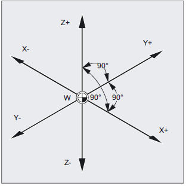

Fundamentos Geométricos
=======================

En esta sección se muestran las definiciones de sistemas de referencia. Etc.

.. _sistCoords:

Sistemas coordenados
--------------------

.. _decaPieza:

Decalaje de Pieza
-----------------

.. _decaHerram:

Decalaje de Herramienta
-----------------------

