Fundamentos Geométricos
=======================

En esta sección se muestran las definiciones de sistemas de referencia; coordenadas absolutas y relativas; centros de coordenadas y 
decalajes que son necesarios para la correcta definición de las posiciones.

.. _defCoords:

Definición de Coordenadas
----------------------------------

A los efectos de que el control pueda interpretar los datos de posición, éstos deben estar expresados en un sistema coordenado 
de referencia. Normalmente se utilizan sistemas de referencia ortogonales cuyas componentes son los ejes X, Y y Z.

Regla de la Mano Derecha
^^^^^^^^^^^^^^^^^^^^^^^^

Los sistemas ortogonales utilizados son dextrógiros, es decir que siguen la regla de la mano derecha.

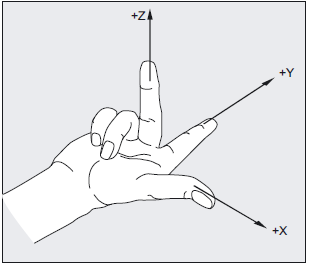
   
   Regla de la mano derecha.
   
   * El dedo pulgar apunta en la dirección del eje X positivo.
   * El dedo índice apunta en la dirección del eje Y positivo.
   * El dedo medio apunta en la dirección del eje Z positivo.
   
Normalmente para operaciones de fresado el plano horizontal corresponde al plano contenido por los ejes X e Y.

.. figure:: images/millingCoordSys.png
   :width: 250
   
   Sistema coordenado para fresado.

Normalmente para operaciones de torneado el eje del husillo correspode al eje Z.

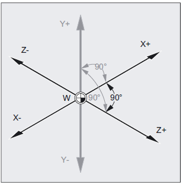
   
   Sistema coordenado para torneado. 

Coordenadas Absolutas
^^^^^^^^^^^^^^^^^^^^^

Cuando se utilizan coordenadas absolutas, las posiciones están referidas al origen del sistema coordenado de referencia.
| Aplicado al movimiento de herramientas significa la posición a la que se moverá la herramienta.

Ejemplo para fresado

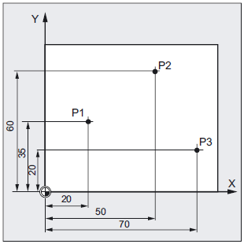
   
   P1 corresponde a X20 Y35
   | P2 corresponde a X50 Y60
   | P3 corresponde a X70 Y20

Ejemplo para torneado

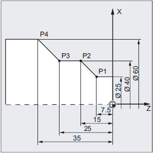
   
   P1 corresponde a X25 Z-7.5
   | P2 corresponde a X40 Z-15
   | P3 corresponde a X40 Z-25
   | P4 corresponde a X60 Z-35
   
   Nota: se muestra este ejemplo utilizando el modo diametral habilitado.

Para definir la posición en coordenadas absolutas al programar se utiliza el código G90.

Coordenadas Relativas
^^^^^^^^^^^^^^^^^^^^^

Frecuentemente nos encontramos con planos que tienen cotas relativas, es decir que la posición de un punto está referido a otro punto.
Para poder evitar la conversión a cotas absolutas se pueden utilizar coordenadas relativas, que refieren a la posición de la definición
del punto previo. 
| Aplicado al movimiento de herramientas significa la distancia que la herramienta se trasladará.

Ejemplo para fresado

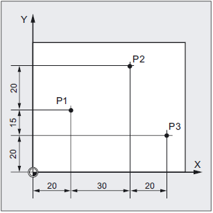
   
   P1 corresponde a X20 Y35 ; (respecto al origen de coordenadas)
   |P2 corresponde a X30 Y20 ; (respecto a P1)
   |P3 corresponde a X20 Y-35 ; (respecto a P2)

Ejemplo para torneado

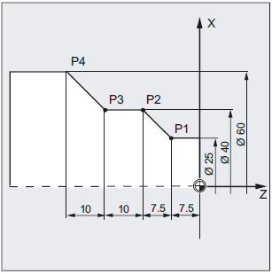
   
   G90 P1 corresponde a X25 Z-7.5; (respecto al origen de coordenadas)
   | G91 P2 corresponde a X15 Z-7.5 ; (respecto a P1)
   | G91 P3 corresponde a Z-10 ; (respecto a P2)
   | G91 P4 corresponde a X20 Z-10 ; (respecto a P3)
   
   Nota: se muestra este ejemplo utilizando el modo diametral habilitado.

Para definir la posición en coordenadas relativas al programar se utiliza el código G91.

Planos de Trabajo
^^^^^^^^^^^^^^^^^

Al programar es necesario especificar el plano en el que se está trabajado para que el sistema de control realizar los cálculos geométricos y pueda utilizar de manera correcta los decalajes de herramientas. 
El plano de trabajo se definen por medio de los códigos G17, G18 o G19 y su definición queda determinada por los dos ejes del sistema coordenado que lo contienen.

* G17 es el plano definido por los ejes X e Y.
* G18 es el plano definido por los ejes X e Z.
* G19 es el plano definido por los ejes Y e Z.

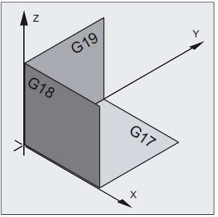
   
   Planos de trabajo para fresado.

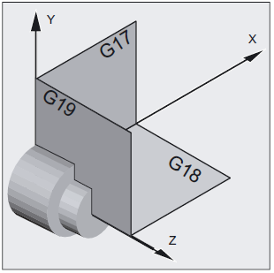
   
   Planos de trabajo para torneado.

El eje que no pertenece al plano es el que determina la dirección de avance de la herramienta.

.. _sistemasCoords:

Sistemas de Coordenadas
-----------------------

En un control numérico se utilizan varios sistemas de coordenadas, que facilitan la definición y el trabajo con la geometría.
La posición relativa de un sistema respecto a otro se denomina decalaje. Estas definiciones son necesarias para que el control 
pueda calcular la posición a la que se deben mover los ejes de la máquina para posicionarse en el lugar definido por el usuario.

Sistema Coordenado de Máquina
"""""""""""""""""""""""""""""

El sistema principal es el sistema de coordenadas de la máquina, éste sistema es fijo y es al cual están referidos otros sistemas de coordendas.
Para referir la posición al sistema de coordenadas de la máquina al programar se utiliza el código G53.

Sistema Coordenado de Piezas
""""""""""""""""""""""""""""

Es de utilidad poder definir sistemas de coordenadas locales para poder por ejemplo, posicionarlos sobre los vértices de una pieza. Al programar
se pueden utilizar los códigos G54 a G59. Cada uno de éstos códigos hace referencia a los distintos sistemas de coordenadas locales.
En el caso de necesitar más de 6 sistemas de coordenadas locales es posible definir más por medio de cógidos G59.1, G59.2 y así sucesivamente.

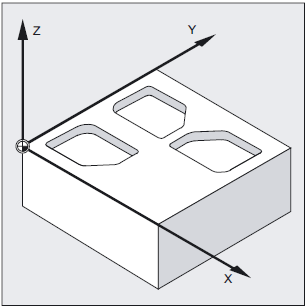
   
   Sistemas de referencia de Pieza.

Se denomina decalaje de pieza a la posición relativa entre el sistema coordenado de la máquina y el sistema coordenado de la pieza.

Decalaje de Origen
""""""""""""""""""

El decalaje de origen determina la posición respecto a la cual las herramientas están definidas.

Decalaje Herramientas
"""""""""""""""""""""

El decalaje de herramienta es la posición del filo de la herramienta respecto al origen o posición de fijación de la misma.
Es útil definir el decalaje para cada herramienta a los fines de poder realizar cambios de herramientas en un programa de 
mecanizado y trabajar con el mismo sistema de referencia, en este caso el control numérico realiza los cálculos para posicionar
adecuadamente los ejes teniendo en cuenta las dimensiones de cada herramienta.

Compensación de Herramientas
""""""""""""""""""""""""""""

Al utilizar una herramienta para mecanizar, el filo de la herramienta puede tener un desgaste. Esto hace que las piezas mecanizadas, con el tiempo,
tengan pequeñas diferencias en sus cotas. Normalmente esta diferencia se detecta al medir las piezas producidas periódicamente. Es posible utilizar
la compensación de herramienta para realizar estas pequeñas correcciones. Al cambiar este valor, el control numérico modifica las posiciones de los 
ejes para compensar la diferencia.

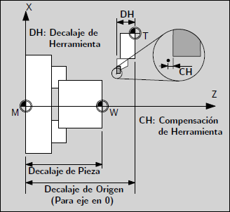
   
   Sistemas de coordenadas.

En la figura se puede observar la relación entre los diferentes sistemas coordenados y los distintos decalajes.

Transformación entre Sistemas
"""""""""""""""""""""""""""""

La posición de un sistema de coordenadas respecto a otro se puede definir a través de diferentes transformaciones. Estas transformaciones incluyen:

* Traslaciones
* Rotaciones
* Escalado
* Espejado

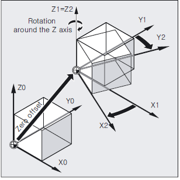
   
   Transformaciones de sistemas de coordenadas.

   
..
   Sistemas Coordenados Básicos
..
   """"""""""""""""""""""""""""
..
   Transmit
..
   Kinenatic transformation
