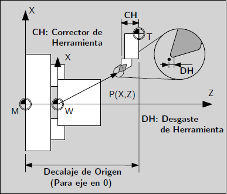

Fundamentos Geométricos
#######################

En esta sección se muestran las definiciones de sistemas de referencia; coordenadas absolutas y relativas; centros de coordenadas y 
decalajes que son necesarios para la correcta definición de las posiciones.

.. _defCoords:

Definición de Coordenadas
=========================

A los efectos de que el control pueda interpretar los datos de posición, éstos deben estar expresados en un sistema coordenado 
de referencia. Normalmente se utilizan sistemas de referencia ortogonales cuyas componentes son los ejes X, Y y Z.

Regla de la Mano Derecha
------------------------

Los sistemas ortogonales utilizados son dextrógiros, es decir que siguen la regla de la mano derecha.

   
   Regla de la mano derecha.
   
   * El dedo pulgar apunta en la dirección del eje X positivo.
   * El dedo índice apunta en la dirección del eje Y positivo.
   * El dedo medio apunta en la dirección del eje Z positivo.
   
Normalmente para operaciones de fresado el plano horizontal corresponde al plano contenido por los ejes X e Y.

.. figure:: images/millingCoordSys.png
   :width: 250
   
   Sistema coordenado para fresado.

Normalmente para operaciones de torneado el eje del husillo correspode al eje Z.

.. figure:: images/turningCoordSys.png
   :width: 250
   
   Sistema coordenado para torneado. 

Coordenadas Absolutas
---------------------

| Cuando se utilizan coordenadas absolutas, las posiciones están referidas al origen del sistema coordenado de referencia.
| Aplicado al movimiento de herramientas significa la posición a la que se moverá la herramienta.

Ejemplo para fresado

.. figure:: images/absoluteMillingCoords.png
   :width: 250
   
   Se pueden definir estas posiciones de la siguiente manera::
   
      P1 corresponde a X20 Y35
      P2 corresponde a X50 Y60
      P3 corresponde a X70 Y20

Ejemplo para torneado

.. figure:: images/absoluteTurningCoords.png
   :width: 250
   
   Se pueden definir estas posiciones de la siguiente manera::
   
      P1 corresponde a X25 Z-7.5
      P2 corresponde a X40 Z-15
      P3 corresponde a X40 Z-25
      P4 corresponde a X60 Z-35

.. admonition:: Nota

   Se muestra este ejemplo utilizando el modo diametral habilitado. Para más información sobre el modo diametral ver
   sección :ref:`G7 <refG7>`.

Para definir la posición en coordenadas absolutas al programar se utiliza el código G90.

Coordenadas Relativas
---------------------

| Frecuentemente nos encontramos con planos que tienen cotas relativas, es decir que la posición de un punto está referido a otro punto.
| Para poder evitar la conversión a cotas absolutas se pueden utilizar coordenadas relativas, que refieren a la posición de la definición
  del punto previo. 
| Aplicado al movimiento de herramientas significa la distancia que la herramienta se trasladará.

Ejemplo para fresado

   
   Se pueden definir estas posiciones de la siguiente manera::
   
      P1 corresponde a X20 Y35 ; (respecto al origen de coordenadas)
      P2 corresponde a X30 Y20 ; (respecto a P1)
      P3 corresponde a X20 Y-35 ; (respecto a P2)

Ejemplo para torneado

.. figure:: images/relativeTurningCoords.png
   :width: 250
   
   Se pueden definir estas posiciones de la siguiente manera::
   
      G90 P1 corresponde a X25 Z-7.5; (respecto al origen de coordenadas)
      G91 P2 corresponde a X15 Z-7.5 ; (respecto a P1)
      G91 P3 corresponde a Z-10 ; (respecto a P2)
      G91 P4 corresponde a X20 Z-10 ; (respecto a P3)

.. admonition:: Nota

   Se muestra este ejemplo utilizando el modo diametral habilitado. Para más información sobre el modo diametral ver
   sección :ref:`G7 <refG7>`.

Para definir la posición en coordenadas relativas al programar se utiliza el código G91.

.. _planoTrabajos:

Planos de Trabajo
-----------------

Al programar es necesario especificar el plano en el que se está trabajado para que el sistema de control realizar los cálculos geométricos y pueda utilizar de manera correcta los decalajes de herramientas. 
El plano de trabajo se definen por medio de los códigos G17, G18 o G19 y su definición queda determinada por los dos ejes del sistema coordenado que lo contienen.

* G17 es el plano definido por los ejes X e Y.
* G18 es el plano definido por los ejes X e Z.
* G19 es el plano definido por los ejes Y e Z.

.. figure:: images/planesMilling.png
   :width: 250
   
   Planos de trabajo para fresado.

.. figure:: images/planesTurning.png
   :width: 250
   
   Planos de trabajo para torneado.

El eje que no pertenece al plano es el que determina la dirección de avance de la herramienta.

.. _sistemasCoords:

Sistemas de Coordenadas
=======================

En un control numérico se utilizan varios sistemas de coordenadas, que facilitan la definición y el trabajo con la geometría.
La posición relativa de un sistema respecto a otro se denomina decalaje. Estas definiciones son necesarias para que el control 
pueda calcular la posición a la que se deben mover los ejes de la máquina para posicionarse en el lugar definido por el usuario.

Sistema Coordenado de Máquina
-----------------------------

El sistema principal es el sistema de coordenadas de la máquina, éste sistema es fijo y es al cual están referidos otros sistemas de coordendas.
Para referir la posición al sistema de coordenadas de la máquina al programar se utiliza el código G53.

Sistema Coordenado de Piezas
----------------------------

Es de utilidad poder definir sistemas de coordenadas locales para poder por ejemplo, posicionarlos sobre los vértices de una pieza. Al programar
se pueden utilizar los códigos G54 a G59. Cada uno de éstos códigos hace referencia a los distintos sistemas de coordenadas locales, que quedan 
definidos respecto al sistema de coordenadas de la máquina.
En el caso de necesitar más de 6 sistemas de coordenadas locales es posible definir más por medio de cógidos G59.1, G59.2 y así sucesivamente.

   
   Sistemas de referencia de Pieza.

Se denomina decalaje de pieza a la posición relativa entre el sistema coordenado de la máquina y el sistema coordenado de la pieza.

Decalaje de Origen
------------------

El decalaje de origen determina la posición respecto a la cual las herramientas están definidas. Se utiliza en conjunto con la corrección de herramientas
para poder utilizar diferentes herramientas en un mismo programa. Normalmente el decalaje de origen sería la posición del porta herramientas respecto al sistema de
coordenadas de la máquina cuando los ejes están en la posición 0.

Corrección de Herramientas
--------------------------

La corrección de herramienta es la posición del filo de la herramienta respecto al origen o posición de fijación de la misma.
Es útil definir el decalaje o dimensiones de cada herramienta a los fines de poder realizar cambios de herramientas en un programa de 
mecanizado y trabajar con el mismo sistema de referencia, en este caso el control numérico realiza los cálculos para posicionar
adecuadamente los ejes teniendo en cuenta las dimensiones de cada herramienta.

Desgaste de Herramientas
------------------------

Al utilizar una herramienta para mecanizar, el filo de la herramienta puede tener un desgaste. Esto hace que las piezas mecanizadas, con el tiempo,
tengan pequeñas diferencias en sus cotas. Normalmente esta diferencia se detecta al medir las piezas producidas periódicamente. Es posible modificar
el dato de desgaste de herramientas para realizar estas pequeñas correcciones. Estos valores se utiliza superponiéndolos a las dimensiones de las herramientas
descriptos en la sección anterior de corrección de herramientas para realizar la compensación.

Compensación de Herramientas
----------------------------

El control numérico tiene en cuenta las dimensiones de las herramietnas y los datos de desgaste para modificar las posiciones de los ejes y posicionar
el filo de la herramienta compensando la diferencia. En la siguiente figura se puede observar la relación entre los diferentes sistemas coordenados y 
los distintos decalajes.

   
   Sistemas de coordenadas.

Para más información sobre la definición y el uso de sistemas coordenados y sus decalajes ver las secciones :ref:`G52 <refG52>`,
:ref:`G54-G59.3 <refG54>`, :ref:`G90 G91 <refG90>` y :ref:`G92 <refG92>`.

.. _transfCoords:

Transformación de Sistemas Coordenados - A ser implementado
===========================================================

Las transformaciones se utilizan para definir la posición de un sistema de coordenadas respecto a otro. 
Son útiles para, por ejemplo, repetir un subprograma de mecanizado en otra posición, con otras escala o de manera espejada, 
sin tener que modificar la subrutina. Para esto se puede modificar la posición, orientación, escala o sentido de los ejes 
de los sistemas coordenados de piezas *G54/G59.3*, a través de instrucciones que se detallan en esta sección.

Las transformaciones y las instrucciones asociadas pueden ser:

* Traslaciones. Funciones *TRANS*, *ATRANS*
* Rotaciones. Funciones *ROT*, *ROT RPL*, *ROTS*, *AROT*, *AROT RPL*, *AROTS*, 
* Escalado. Funciones *SCALE*, *ASCALE*
* Espejado. Funciones *MIRROR*, *AMIRROR*

   
   Ejemplos de las diferentes transformaciones.

Estas funciones se pueden utilizar individualmente o en combinación.

Ejemplo de transformaciones::

   TRANS X... Y... Z...   (traslación absoluta, cancela transformaciones previas)
   ATRANS X... Y... Z...  (adiciona una traslación)
   ROT X... Y... Z...     (serie de rotaciones respecto a los ejes del sistema rotado según orden establecido)
   ROT RPL=...            (rotación en plano de trabajo activo)
   ROTS X...      (con 1 valor, mismo efecto que ROT X...)
   ROTS X... Y... (rotación absoluta, 2 valores como máximo, son ángulos de intersección con planos originales)
   AROTS Z...     (con 1 valor, mismo efecto que AROT Z...)
   AROTS X... Z... (rotación aditiva, 2 valores como máximo, son ángulos de intersección con planos originales)
   MIRROR X0 Y0 Z0   (los valores de X, Y y/o Z son desestimados)
   AMIRROR X0 Y0 Z0   (los valores de X, Y y/o Z son desestimados)

Las instrucciones se programan en líneas separadas y se ejecutan en el orden programado.

.. admonition:: Nota

   Hay instrucciones que son absolutas, es decir que cancelan las transformaciones previamente definidas y dejan en efecto
   sólo la transformación definida por ellas, estas son: *TRANS*, *ROT*, *ROT RPL* *ROTS*, *SCALE* y *MIRROR*. 
   En cambio hay instrucciones aditivas, es decir que superponen su efecto a las transformaciones previas, estas son *ATRANS*,
   *AROT*, *AROT RPL*, *AROTS*, *ASCALE* y *AMIRROR*. En cambio, las instrucciones que comienzan 

.. admonition:: Nota

   El efecto de todas las transformaciones se puede cancelar llamando a cualquier instrucción absoluta
   sin especificar valores de ejes, por ejemplo *TRANS*, *ROT*, *SCALE* o *MIRROR*.

Traslaciones
------------

El efecto que tiene la instrucción de traslación es similar a utilizar las funciones de decalaje de los sistemas coordenados 
de piezas. Al utilizar la función *TRANS* con uno o varios valores de eje, se cancelan las transformaciones previamente 
definidas y se aplican solamente las definidas en esta línea de código.

   
   Función absoluta *TRANS* y luego otra función *TRANS*.

Al utilizar la función *ATRANS* con uno o varios valores de eje, se mantienen las transformaciones previamente 
definidas y se superpone el efecto de traslación definido en esta línea de código.

   
   Función absoluta *TRANS* y luego una traslación aditiva *ATRANS*.

El efecto de una traslación se superpone al decalaje del sistema coordenado de pieza, como se muestra en la siguiente figura.

   
   Función *TRANS* y sistema coordenado de pieza *G54*.

.. admonition:: Nota

   Si previamente se ha utilizado la función *SCALE* o *ASCALE* la traslación definida se ve afectada por las escalas existentes 
   de cada eje.

Rotaciones
----------

Existen tres tipos diferentes de instrucciones para rotar al sistema coordenado:

   * Rotación en el plano de trabajo. Funciones *ROT RPL* y *AROT RPL*
   * Rotación en el espacio según una secuencia de rotaciones de ejes. Funciones *ROT* y *AROT*
   * Rotación en el espacio según ángulos de intersecciones con planos originales. *ROTS* y *AROTS*

**Funciones ROT RPL y AROT RPL**

Las instrucciones *ROT RPL* y *AROT RPL* se utilizan para rotar el sistema coordenado en el plano de trabajo. La dirección y sentido de rotación
lo define el eje perpendicular al plano de trabajo activo. Por ejemplo, si está activo el comando *G17*, el plano de trabajo es el *XY*, 
entonces la rotación se realiza según la dirección y sentido definido por el eje *Z*.

Ejemplo de *ROT RPL*::

   G18 ;Plano de trabajo XZ
   ROTS RPL -50 ;Rotación según sentido negativo del eje Y 50°

El comando *ROT RPL* cancela todas las transformaciones previas y aplica la rotación definida por la línea, mientras que el comando *AROT RPL* mantiene
las transformaciones previas y aplica la transformación definida de manera aditiva.

   
   Efecto de la rotación en la orientación de los ejes

.. admonition:: Nota

   Si programa un cambio del plano de trabajo (*G17* a *G19*) luego de una rotación, los ángulos de rotación de los ejes se mantienen y afecta al nuevo plano de
   trabajo. Es por esto que es recomendable desactivar la rotación antes de un cambio del plano de trabajo.

*Ejemplo de traslación y rotación en el plano*

En esta pieza se repite la geometría en diferentes lugares y con distintas orientaciones. Para utilizar el mismo
subprograma se debe trasladar y rotar el sistema coordenado de pieza.

::

   N10 G17 G54 ;Plano de trabajo X/Y, sistema coordenado de pieza en origen
   N20 TRANS X20 Y10 ;Traslación absoluta
   N30 L10 ;LLamada a subprograma
   N40 TRANS X55 Y35 ;Traslación absoluta
   N50 AROT RPL=45 ;Rotación aditiva del sistema en el plano a 45°
   N60 L10 ;LLamada a subprograma
   N70 TRANS X20 Y40 ;Traslación absoluta
   ;(cancela transformaciones previas)
   N80 AROT RPL=60 ;Rotación aditiva en el plano a 60°
   N90 L10 ;LLamada a subprograma
   N100 G0 X100 Y100 ;Retracción
   N110 M30 ;Fin de programa

   
   Ejemplo de traslación y rotación en el plano

**Funciones ROT y AROT**

Las instrucciones *ROT* y *AROT* se utilizan para rotar en el espacio al sistema coordenado, realizando una secuencia de rotaciones intrínsecas 
según los ejes coordenados. Se pueden definir con valores en un solo eje, dos o los tres ejes, con lo que se puede lograr cualquier orientación posible en el espacio.

Las rotaciones son intrínsecas, lo que significa que las rotaciones se aplican según la posición del eje en cuestión teniendo en cuenta las rotaciones previas, en 
contraposición con las rotaciones extrínsecas, que se realizan según la orientación inicial del sistema. Por defecto las secuencia de rotaciones utilizada es 
la RPY (Rool Pitch Yaw) en el orden ZYX.

*Sentido de rotaciones*

Al definir los valores tenga en cuenta el sentido positivo que se muestra en la siguiente figura.

   
   Sentido de rotación de ejes

*Orden de rotaciones*

Se pueden programar hasta 3 rotaciones sucesivas en conjunto definidas en un solo comando *ROT/AROT*. La secuencia por defecto es la RPY (Rool Pitch Yaw), 
es decir que aplica un giro según el eje Z inicial, luego un giro según la dirección actualizada del eje Y y finalmente un giro según la dirección actualizada 
del eje X.

   
   Orden de rotación de ejes

Los valores que se pueden utilizar para este comando deben estar dentro de los siguientes rangos, con los que se puede lograr cualquier orientación del espacio:

   * Rotación alrededor del eje X: :math:`-180^{\circ} \le X \le +180^{\circ}` 
   * Rotación alrededor del eje Y:  :math:`-90^{\circ} < Y < +90^{\circ}` 
   * Rotación alrededor del eje Z: :math:`-180^{\circ} \le Z \le +180^{\circ}` 

De la misma forma que las demás transformaciones, al utilizar la función *ROT* se cancela el efecto de las transformaciones previamente definidas, mientras que la 
función *AROT* mantiene las transformaciones previas y aplica la rotación de forma aditiva.

*Ejemplo de traslación y rotación en el espacio en 1 eje*

En este ejemplo se mecaniza la misma geometría en un plano horizontal y otro inclinado utilizando el mismo subprograma.
La herramienta debe ser alineada perpendicular al plano inclinado para ese mecanizado.

::

   N10 G17 G54 ;Plano de trabajo X/Y, sistema coordenado de pieza en origen
   N20 TRANS X10 Y10 ;Traslación absoluta
   N30 L10 ;LLamada a subprograma
   N40 ATRANS X35 ;Traslación aditiva
   N50 AROT Y30 ;Rotación aditiva al rededor del eje Y 35°
   N60 ATRANS X5 ;Traslación aditiva
   N70 L10 ;LLamada a subprograma
   N80 G0 X300 Y100 M30 ;Retracción, fin de programa

   
   Ejemplo de traslación y rotación en el espacio

*Ejemplo de rotación en el espacio en 3 ejes*

En este ejemplo se rota al sistema en el espacio a través de la función *ROT* especificando 3 valores de ejes. El proceso y la orientación final se muestra en
la siguente figura.

::

   N10 ROT X90 Y90 Z90

   
   Ejemplo de rotacion en el espacio ROT X... Y... Z...

   
*Llamadas secuenciales de rotación*

Si se quiere utilizar una secuencia particular de rotaciones que no se corresponde con las predefinidas, es posible llamar de manera secuencial a la 
función *ROT/AROT*. Por ejemplo::

   ROT X30   ;Rotación según eje X en 30°, cancelando cualquier transformación previa
   AROT Z-50 ;Rotación según eje Z (ya rotado) en -50°, superponiendo el efecto
   AROT Y15  ;Rotación según eje Y (ya rotado) en 15°, superponiendo el efecto

**Funciones ROTS y AROTS**

Estas funciones permiten alinear al plano de trabajo en el espacio a través del ángulo que forma su interescción con los otros planos orginales.
Tienen el efecto de rotar el plano pero no modifican la posición del origen. 

Admiten como máximo dos valores, ya que un tercer valor conduciría a una sobre restricción.
Por ejemplo si se programa *ROTS X*:math:`\alpha` *Y*:math:`\beta`, la intersección del plano XY girado con el plano original XZ, formará un ángulo igual a
:math:`\alpha` respecto al eje original X y la intersección del plano XY girado con el plano original YZ, formará un ángulo igual a :math:`\beta` respecto al eje original Y.

En la siguiente figura se muestra el efecto de la función *ROTS* cuando se la utiliza con dos argumentos en las diferentes combinaciones.

   
   Efecto de funciones  a) *ROTS X*:math:`\alpha` *Y*:math:`\beta`  b) *ROTS Z*:math:`\gamma` *X*:math:`\alpha`  c) *ROTS Y*:math:`\beta` *Z*:math:`\gamma`

La orientación descripta en la figura anterior se realiza con las siguientes rotaciones:

   *ROTS X*:math:`\alpha` *Y*:math:`\beta`
      a) Rotación alrededor del eje Y un ángulo :math:`\alpha`
      b) Rotación alrededor del eje X' un ángulo necesario para formar el ángulo :math:`\beta`

   *ROTS Z*:math:`\gamma` *X*:math:`\alpha`
      a) Rotación alrededor del eje X un ángulo :math:`\gamma`
      b) Rotación alrededor del eje Z' un ángulo necesario para formar el ángulo :math:`\alpha`

   *ROTS Y*:math:`\beta` *Z*:math:`\gamma`
      a) Rotación alrededor del eje Z un ángulo :math:`\beta`
      b) Rotación alrededor del eje Y' un ángulo necesario para formar el ángulo :math:`\gamma`

La rotación se realiza de tal forma que el primer eje rotado queda en el plano formado por éste y el tercer eje del sistema original.
Por ejemplo, para *ROTS X Y*, X' queda en el plano XZ original.

Cuando se utiliza la función *ROTS/AROTS* con un solo argumento el efecto es idéntico a la función *ROT/AROT*, por ejemplo *ROTS X20* rota el sistema coordenado 20 grados
alrededor del eje X.

*Efecto de rotación en el plano de trabajo*

Al definir una rotación del sistema coordenado el plano de trabajo también rota, de esta forma se mantiene la designación de los ejes para
la compensación del radio y el largo de la herramienta. Por ejemplo como muestra la siguiente figura, para *G17* o plano de trabajo *XY*, 
al rotar según el eje *Y* 90 grados, giran los ejes, y el largo de la herramienta sigue compensandose según el eje *Z*.

   
   Efecto de rotación en el plano de trabajo

Escalado
--------

Con las funciones *SCALE/ASCALE* se puede cambiar la escala de los ejes especificados con valores individuales para cada eje. 
Esto afecta a todos los movimientos que se realicen posteriormente. Para desactivar el efecto del escalado utilice la función *SCALE* o *ASCALE*
sin valores de ejes.

   
   Efecto del escalado

La función *SCALE* cancela el efecto de las transformaciones definidas previamente, mientras que la función *ASCALE* mantiene las transformaciones 
previas y aplica el escalado de forma aditiva.

   
   Superposición de traslación, rotación y escalado

*Ejemplo de escalado*

En una pieza se deben mecanizar dos geometrías similares, pero de diferentes dimensiones y en diferentes orientaciones. La secuencia de mecanizado se 
define en un subprograma.

Se utilizan las funciones de traslación y rotación para cambiar el origen y orientacipn de los ejes y la función de escalado para reducir el tamaño 
de la geometría, llamando nuevamente al subprograma de mecanizado.

   
   Ejemplo de escalado

::

   N10 G17 G54 ;Plano de trabajo XY, sistema de coordenada de pieza G54
   N20 TRANS X15 Y15 ;Traslación (cancela transformaciones previas)
   N30 L10 ;Mecanizado de geometría grande
   N40 TRANS X40 Y20 ;Traslación (cancela transformaciones previas)
   N50 AROT RPL=35 ;Rotación en el plano 35°, aditiva
   N60 ASCALE X0.7 Y0.7 ;Factor de escalado para la geometría pequeña
   N70 L10 ;Mecanizado de geometría pequeña
   N80G0 X300 Y100 M30 ;Retracción, fin de programa

.. admonition:: Nota

   Si previamente se ha utilizado la función *SCALE* o *ASCALE* la traslación definida se ve afectada por las escalas existentes 
   de cada eje.

   
   Efecto del escalado en arcos, se distorsionan si no se utiliza el mismo factor de escala

.. admonition:: Nota

   Tenga en cuenta que al utilizar diferentes escalas en distintos ejes las instrucciones *G2/G3* dejarán de producir arcos de círculos y se distorsionarán

Espejado
--------

Las funciones *MIRROR/AMIRROR* se utilizan para cambiar el sentido de los ejes del sistema coordenado. Los valores de ejes especificados se desestiman y el espejado se
realiza respecto al origen del sistema coordenado. 

Todas las instrucciones de traslación que se realicen luego de un espejado se realizan en la dirección ya espejada.

El espejado afecta también a rotaciones posteriores, por lo que en determinadas circunstancias es posible que deba trabajar con sentidos de giro invertidos.

::

   MIRROR X0 Y100 ;Invierte sentido de los eje X e Y, no tiene en cuenta los valores 
                  ;El espejado se realiza respecto al origen de coordenadas

*Ejemplo de espejado*

   
   Espejado

::

   N10 G17 G54 ;Plano de trabajo XY, sistema de coordenada de pieza G54
   N20 L10 ;Mecanizado de la primera geometría, arriba a la derecha
   N30 MIRROR X0 ;Espejado del eje X (el sentido se invierte en X)
   N40 L10 ;Mecanizado de la segunda geometría, arriba a la izquierda
   N50 AMIRROR Y0 ;Espejado del eje Y aditiva (el sentido también se invierte en Y)
   N60 L10 ;Mecanizado de la tercer geometría, abajo a la izquierda
   N70 MIRROR Y0 ;Cancela espejados previos. Espejado del eje Y
   N80 L10 ;Mecanizado de la cuarta geometría, abajo a la derecha
   N90 MIRROR ;Desactivar espejado
   N100 G0 X300 Y100 M30 ;Retracción, fin de programa

Un espejado puede ser aplicado aditivamente a una transformación previa, utilizando la función *AMIRROR*. En este caso el origen de coordenada ya modificado se 
utiliza como referencia para realizar el espejado.

   
   Efecto de traslación y espejado

El espejado puede afectar también a la geometría de los arcos de círculo *G2/G3* y a el lado por el cual se debe realizar la compensación
del radio de herramienta *G41/G42*, pudiéndolos invertir. Estas situaciones son identificadas por el controlador y son corregidas, es por esto que al trabajar con 
el espejado puede parecer que el controlador está realizando el árco de círculo o la compensación de radio de herramienta con sentido cambiado.

   
   Efecto del espejado en arco de círculos *G2/G3* y compensación de radio de herramienta *G41/G42*

..
   Transformaciones Cinemáticas
..
   ----------------------------
..
   Transmit
..
   Kinenatic transformation
