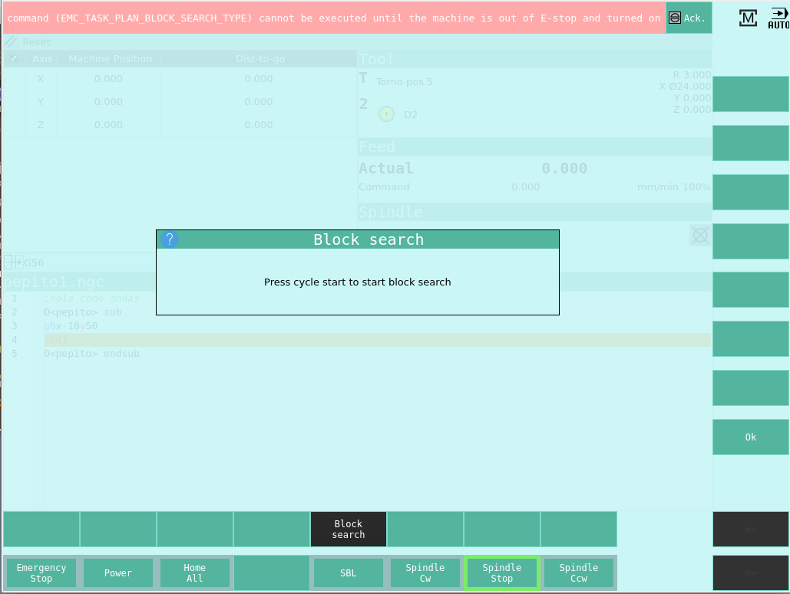
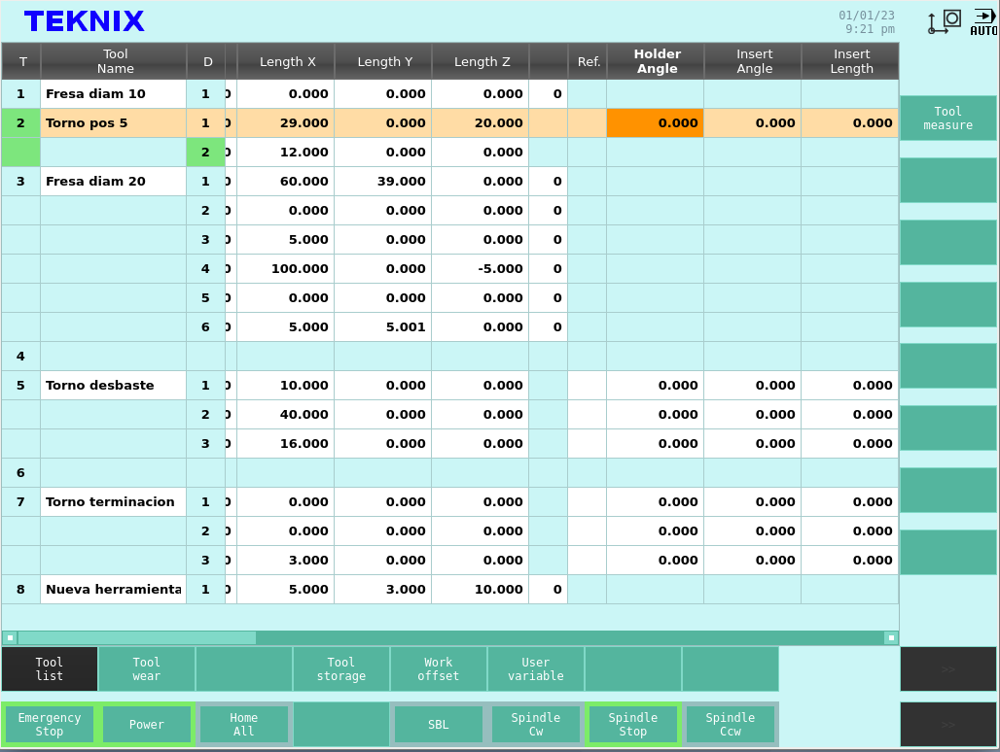
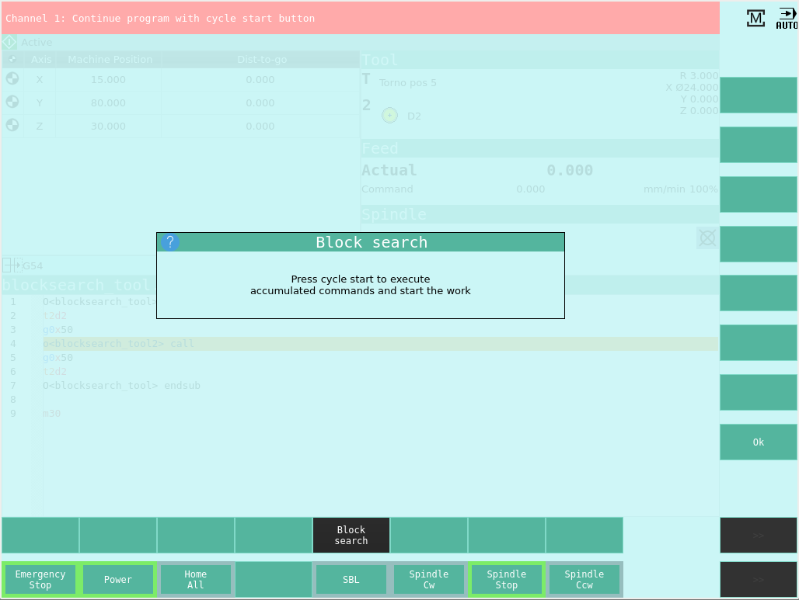

Interfaz de Usuario
###################
      
En esta sección se describen las funcionalidades y modo de operación de interfaz de usuario.
Básicamente se puede dividir a la interfaz en su pantalla táctil principal por una parte y el teclado, botones y perillas por otro.

.. _teclados:

Teclado y botones
=================

El teclado y botones configura la parte física de la interfaz de usuario. En su versión usual, el control cuenta con los siguientes elementos.

**Botón de emergencia**

El botón de emergencia está ubicado en una posición accesible para el operador. En caso de una emergencia se deberá presionar el botón, lo que hará
que el control numérico frene lo más rápido posible el husillo y el movimiento de la máquina. En caso de emergencia todas las funciones que se manejen por el 
PLC (Controlador Lógico Programable) de la máquina pueden ser llevadas al modo de seguridad con el que se configuren.
Para desactivar el accionamiento del botón de emergencia el operador debe girarlo, lo que hará que salga de su posición retraída. 
Desactivar el botón de emergencia no sacará a la máquina del estado de emergencia ni iniciará el giro del husillo o el movimiento.
Luego de la activación de la emergencia no es necesario realizar el referenciado de los ejes nuevamente.

.. figure:: images/emergencyButton.png
   :width: 120
   
   Botón de parada de emergencia

**Rueda para Jogging**

La rueda para jogging se utiliza para cambiar la posición de forma manual, permite mover el eje seleccionado en ambos sentidos de forma intuitiva.
La velocidad de movimiento y por ende la diferencia de posición que representa cada pulso de la rueda se elige con el selector de escala que se describe a continuación.
Para que funcione la rueda de jogging el controlador debe estar en modo manual y sin errores pendientes de confirmación.

.. figure:: images/joggingWheel.png
   :width: 160
   
   Botón de parada de emergencia

**Selector de escala**

Se utiliza para seleccionar la escala con la que trabaja la rueda de jogging. Para movimientos más largos elija escalas más grandes y para posicionar con
mayor presición elija escalas más pequeñas.

.. figure:: images/scaleSelector.png
   :width: 90
   
   Selector de escala

**Selector de eje**

Se utiliza para seleccionar el eje que se moverá mediante la rueda de jogging cuando el controlador esté en modo de movimiento manual.

.. figure:: images/axisSelector.png
   :width: 110
   
   Selector de eje

**Perilla de override de velocidad de avance**

.. figure:: images/knobFeedOverride.png
   :width: 120
   
   Perilla de override de velocidad de avance

La perilla de override permite reducir la velocidad de avance real respecto a la velocidad de avance programada. La escala elegible va en un rango desde el 0 al 100 %.

**Botones de Ciclo**

El controlador dispone en su versión clásica de los siguientes botones para controlar el flujo de ciclos en el modo de operación automático:

   * *Cycle Start* - Inicio de ciclo
   * *Cycle Stop* - Pausa de ciclo 
   * *Reset* - Reinicio de errores y de ciclo 

**Puertos USB**

El control dispone de puertos USB para la conexión de dispositivos de almacenamiento que permiten guardar o cargar carpetas y archivos.

Pantalla Táctil
===============

La pantalla táctil brinda las funcionalidades de manejo y edición de archivos; visualización del estado de máquina; editor de decalajes,
incluido un gestor de herramientas; ingreso de código G manual directo y visualizador de alarma y mensages, entre otras.
Las funcionalidades y modos de operación se decribe en las siguientes secciones.

.. _pantallaMaquina:

Pantallas de Máquina
====================

La pantalla que se muestra al iniciar el control es la pantalla de máquina, en donde se puede ver el estado general de la misma.

.. figure:: images/HMIscreenMachine.png
   :width: 750
   
   Pantalla principal de máquina

En la parte superior posee una barra horizontal que cuando no hay alarmas activas tiene la leyenda *TEKNIX*. 

Abajo de la barra superior, en el sector izquierdo se ven las posiciones actuales de los ejes y la distancia que deberán recorrer los mismos para llegar al punto final de la próxima instrucción.
Estas coordenadas se pueden ver en el sistema de coordenadas de la máquina o en el sistema de coordenadas de la pieza vigente. Para cambiar la visualización entre el sistema 
de coordenadas de máquina y de pieza se utilizan los botones *MCS* y *WCS* ubicados en la barra lateral de la derecha.

En la parte inferior de esta sección se muestra el sistema coordenado activo, es decir con el que se referencian los comandos de posición.

Abajo de la barra superior, en el sector derecho esta pantalla muestra la información sobre la herramienta actual, incluyendo: número de herramienta; descripción; filo seleccionado; orientación; 
radio de filo y decalajes. Abajo de la información de la herramienta se muestra la velocidad de avance actual y la programada, en las unidades correspondiente y el override.
Abajo de esto se muestra la velocidad de husillo actual y programada, con un símbolo que indica si está frenado o en qué sentido está girando.

Abajo de estas secciones se muestra el programa en ejecución. Si no ha sido seleccionado un programa para su ejecución esta parte de la pantalla estará vacía.

En el extremo inferior esta pantalla muestra una barra horizontal con botones, cuyos rebordes se remarcan de verde cuando están activos.
De izquierda a derecha se muestra si está activa:

   * *Emergency Stop* - Parada de emergencia
   * *Power* - Energía de motores
   * *Home All* - Referenciado de ejes
   * *SBL (Single Block)* - Ejecución de la siguiente línea
   * *Spindle Cw* - Husillo girando en sentido horario
   * *Spindle Cw* - Husillo frenado
   * *Spindle Ccw* - Husillo girando en sentido antihorario

.. admonition:: Nota
   :class: note

   El botón *SBL* se utiliza para verificar un programa ejecutando línea por línea. En caso de estar en modo de ejecución automático y tener suavizado de trayectoria, se respeta la trayectoria
   con el suavizado. El movimiento del paso se ejecuta hasta el punto en el que se inicia el suavizado. Al presionar nuevamente el botón *SBL*, el próximo paso
   incluye la parte de la trayectoria suavizada entre movimientos y el siguiente movimiento (sin incluir el suavizado siguiente).

Arriba de la barra horizonal inferior se muestra el botón *Set WO* que permite modificar los decalajes del sistema de coordenadas actual, pantalla que se muestra en la siguiente figura.

.. figure:: images/HMIscreenSetWorkOffset.png
   :width: 750
   
   Edición de decalajes de sistemas coordenados actual

En el extremo derecho la pantalla tiene una barra vertical con botones. Esta barra se encuentra en diferentes pantallas en las que las acciones de los botones cambian según
el contexto. En esta pantalla están activos los botones:

   * *Active G Codes*
   * *MCS / WCS*

En cuanto al botón *MCS / WCS* como ya se mencionó se utiliza para cambiar el sistema coordenado para la visualización de la posición actual.

Al presionar en el boton *Active G Codes* se despliega un listado de los códigos activos en cada estado modal, que se muestra en la siguiente figura.

.. figure:: images/HMIscreenMachineActiveGcodes.png
   :width: 750
   
   Pantalla principal de máquina, códigos activos

En el caso de que se active una alarma se mostrará en la barra superior, en la que aparecerá una descripción acotada y un botón con la leyenda *Ack.* que permite
acusar recibo de la misma. En caso de querer ver el detalle de la alarma en cuestión o ver el listado se deberá ir a la pantalla de diagnóstico.
En la siguiente figura se muestra un ejemplo de una alarma activa.

   
   Pantalla principal de máquina, alarma activa

En el extremo superior derecho muestran dos íconos. El de la izquierda muestra qué pantalla está activa y el de la derecha muestra qué modo de operación está activo.
Los íconos y su significado se muestran en las siguientes figuras.

.. figure:: images/HMImachineIcon.png
   :width: 35
   
   Símbolo de Pantalla de Máquina

.. figure:: images/HMIoffsetIcon.png
   :width: 35
   
   Símbolo de Pantalla de Decalajes

.. figure:: images/HMIeditorIcon.png
   :width: 35
   
   Símbolo de Pantalla de Editor

.. figure:: images/HMIprogramsIcon.png
   :width: 35
   
   Símbolo de Pantalla de Programas

.. figure:: images/HMIdiagnosisIcon.png
   :width: 35
   
   Símbolo de Pantalla de Diagnóstico

.. figure:: images/HMIjoggingIcon.png
   :width: 35
   
   Símbolo de Modo de Jogging

.. figure:: images/HMImdaIcon.png
   :width: 35
   
   Símbolo de Modo de Input Manual Directo

.. figure:: images/HMIautoIcon.png
   :width: 35
   
   Símbolo de Modo de Automático

Al presionar sobre cualquiera de estos íconos se activa el menú principal, pantalla que se muestra en la siguiente figura.

.. figure:: images/HMIscreenMenu.png
   :width: 750
   
   Menu principal

En la barra horizontal inferior del menú principal se encuentra los botones que llevan a las siguientes pantallas:

   * *MACHINE* - Pantalla de máquina, descripta en esta sección.
   * *OFFSETS* - Pantalla de decalajes. 
   * *EDITOR* - Pantalla de edición de programas. 
   * *PROGRAMS* - Pantalla de visualización de archivos.
   * *DIAGNOSIS* - Pantalla de alarmas y mensajes

En la barra vertical derecha del menú principal se encuentra los botones que activan los siguientes modos de operación:

   * *JOG* - Modo de Jogging, es decir, moviento manual.
   * *REF* - Referenciado de ejes. 
   * *MDI* - Modo de ingreso manual directo. 
   * *AUTO* - Modo automático.

Las diferentes pantallas y modos de funcionamiento se describen en las siguientes secciones.

   .. _HMIoffset:

Pantalla de Decalajes
=====================

En la pantalla de decalajes, la barra horizontal inferior muestra las siguientes opciones:

   * *Tool list* - Editor de herramientas
   * *Tool wear* - Desgaste de herramientas
   * *Tool storage* - Almacén de herramientas
   * *Work offset* - Decalajes de sistemas coordenados
   * *User variable* - Variables de usuario

**Editor de herramientas**

Esta pantalla permite visualizar toda la información sobre las herramientas cargadas en el control. También permite 
modificarlas, crear nuevas, eliminarlas o descargarlas llevándolas a un almacen de herramientas, donde queda la información 
de las mismas pero no están disponibles para su uso.

.. figure:: images/HMItoolList.png
   :width: 750
   
   Editor de herramientas, parte izquieda

La información de las herramientas se muestra en una tabla en donde las columnas, de izquierda a derecha, muestra:

   * *T* - Número de la herramienta
   * *Tool Name* - Nombre de la herramienta
   * *D* - Número de filo. Una herramienta puede tener más de un filo, en cuyo caso se expande la cantidad de filas.
   * *Tool Type* - Tipo de herramienta. Puede ser de Torneado (Turning) o de Fresado (Milling).
   * *E* - Habilita el conteo de vida útil de herramienta.
   * *Length* - Largo. Disponible solo para herramientas de Fresado.
   * *Ori* - Orientación. Se muestra con símbolos. Disponible solo para herramientas de torneado.
   * *Radius* o :math:`\varnothing` - Diámetro o radio, según se trate de herramienta de Torneado o Fresado.
   * *Length X* - Largo en dirección X.
   * *Length Y* - Largo en dirección Y.
   * *Length Z* - Largo en dirección Z.
   * *N* Cantidad de Insertos. Disponible solo para herramientas de fresado.
   * *Ref.* - Referencia de dirección de ataque. Disponible solo para herramientas de torneado. 
   * *Holder Angle* - Ángulo de Portaherramienta. Disponible solo para herramientas de torneado.
   * *Insert Angle* - Ángulo de inserto. Disponible solo para herramientas de torneado.
   * *Insert Lenght* - Longitud de inserto. Disponible solo para herramientas de torneado.

Los últimos 4 parámetros, (*Ref*, *Holder Angle*, *Insert Angle* e *Insert Lenght*) se utilizan para el visualizador y para verificar que 
la orientación del inserto seleccionada es válida.

Los títulos de columnas aparecen y desaparecen de acuerdo a la herramienta que se está editando, ya se si se aplican a herramientas
de fresado o torneado. 

.. admonition:: Nota
   :class: note

   Las herramientas de fresado tienen los parámetros *Largo*; *Largo en X*; *Largo en Y* y *Largo en Z*. Los últimos 3 se utilizan para dar la posición de la
   herramienta de manera fija en coordenadas de máquina, es decir que el controlador corrige los ejes en esas magnitudes siempre, independientemente del plano de trabajo activo.
   En cambio, el parámetro *Largo* se utiliza para corregir la posición según la dirección perpendicular al plano de trabajo. Generalmente los *Largo X, Y Z* se utilizan para
   herramientas múltiples, sino tiene valor 0.

   
   Editor de herramientas, parte derecha

La herramienta y el filo que están cargados se remarcan de color verde.

En la barra vertical derecha, al seleccionar la herramienta activa se muestra el botón *Tool Measure* que se utiliza para calcular los decalajes de la herramienta posicionándola en 
un punto con coordenadas conocidas.

Al seleccionar una herramienta que no es la herramienta activa, en la barra derecha aparecen los siguientes botones:

   * *Edges >* - Cambiar página de botones a Filos
   * *Unload* - Descargar. Leva la herramienta al almacén
   * *Delete tool* - Borra la herramienta
   * *<< Back* - Volver a página anterior de botones

Si se presiona el botón *Edges >* se activan los botones *New cutting edge* para definir un nuevo filo, *Delete cutting edge* para borrar el filo seleccionado
(en caso de haber seleccinado un filo que no sea el filo 1) y el botón *<< Back* para volver a los botones anteriores.

Al seleccionar una fila vacía aparece el botón *New tool* para crear una nueva herramienta y el botón *Load* para cargar una herramienta existente desde el almacén de herramientas.
Si se presiona el botón *Load* aparece un menú desplegable para seleccionar una herramienta de las disponibles en el almacén.

.. admonition:: Nota
   :class: note

   Los valores de los parámetros de la tabla se pueden editar, borrando el número y escribiendo un nuevo o utilizando operaciones matemáticas, por ejemplo, si el número existente es
   *5.0* se puede escribir *5.0+1.78* y al salir de la edición quedará el número *6.78*

**Desgaste de herramientas**

La tabla de desgaste de herramientas es similar a la de decalajes sin la posibilidad de editar, borrar o agregar herramientas.
Se utiliza para compensar los valores de decalajes a medida que los filos de las herramientas se gastan por su uso o para realizar
pequeñas correcciones. Aparecen los siguientes parámetros análogos a la tabla de decalajes, los que el cotrolador considera en 
conjunto para realizar la compensación:

   * :math:`\Delta` *Length* - Corrección de longitud de herramienta
   * :math:`\Delta \varnothing` - Corrección de diámetro de herramienta
   * :math:`\Delta` *Length X*- Corrección de longitud de herramienta en X
   * :math:`\Delta` *Length Y*- Corrección de longitud de herramienta en Y
   * :math:`\Delta` *Length Z*- Corrección de longitud de herramienta en Z

.. figure:: images/HMItoolWear.png
   :width: 750
   
   Desgaste de herramientas

**Almacén de herramientas**

El almacén de herramientas se utiliza para guardar definiciones de herramientas para su uso futuro. Estas herramientas no están disponibles
para el uso pero pueden ser cargadas desde esta pantalla o desde la pantalla de editor de herramientas.

.. figure:: images/HMItoolStorage.png
   :width: 750
   
   Almacén de herramientas

Cuando se selecciona una herramienta en el almacén aparecen los botones *Load* para llevar la herramienta al editor de herramientas y
poder utilizarla y el botón *Delete tool* para borrar la definición de manera permanente.

**Decalajes de sistemas coordenados**

Esta pantalla muestra los valores de decalajes del sistema de coordenadas de máquina y de piezas.
El sistema activo de coordenadas se muestra resaltado en verde. En esta pantalla se pueden editar los valores de cualquier sistema coordenado. 
En la barra derecha se muestra el botón *Clear Work Offset* para cambiar todos los valores del sistema seleccinado a cero.

.. figure:: images/HMIworkOffset.png
   :width: 750
   
   Decalajes de sistemas coordenados

**Variables de usuario**

La pantalla de variables de usuario muestra el valor y permite editar todas las variables de usuario. Como en la tabla de parámetros de herramientas
se pueden editar las variables borrando el valor y escribiendo el nuevo o se pueden utilizar operaciones matemáticas.

.. figure:: images/HMIuserVariable.png
   :width: 750
   
   Variables de usuario

.. _editProgramas:

Editor de Programas
===================

En esta pantalla se pueden visualizar y editar los archivos de código G. En la siguiente figura se muestra la pantalla de edición.

En la barra derecha se muestran los siguientes botones:

   * *View* - Vizualizar trayectoria. No implementado
   * *Open* - Abrir programa
   * *Close* - Cerrar programa
   * *Mark* - Comenzar seleccionado de texto
   * *Copy* - Copiar texto
   * *Paste* - Pegar Texto
   * *Cut* - Cortar texto
   * *>>* o *<<* - Cambiar página de botones

.. figure:: images/HMIscreenEditorOpenedFile.png
   :width: 750
   
   Editor de achivos

En la siguiente imagen se muestra una porción de texto selecionado mediante el uso del botón *Mark*.

.. figure:: images/HMIscreenEditorMark.png
   :width: 750
   
   Editor de achivos, selección de líneas

El editor permite abrir simultáneamente dos o más archivos, que se muestran en columnas diferentes, como en la siguiente figura.

.. figure:: images/HMIscreenEditor2files.png
   :width: 750
   
   Editor de achivos, varios archivos

Pantalla de Programa
====================

La pantalla de programas permite explorar los directorios; seleccionar los archivos; copiarlos, borrarlos o cambiarlos de carpeta.
Los botones disponibles en la barra derecha son los siguientes:

   * *Execute* - Ejecutar archivo. El archivo seleccionado será el que se ejecutará en el modo automático
   * *New* - Nuevo archivo o carpeta
   * *Open* - Abrir archivo o carpeta
   * *Copy* - Copiar archivo o carpeta
   * *Paste* - Pegar archivo o carpeta
   * *Cut* - Cortar archivo o carpeta
   * *Delete* - Borrar archivo o carpeta
   * *>>* o *<<* - Cambiar página de botones

.. figure:: images/HMIscreenEditor.png
   :width: 750
   
   Listado de achivos y carpetas

En la barra inferior se muestran los botones *Programs* y *USB* que permiten intercalar entre los archivos y carpetas guardados en el 
controlador y en un dispositivo de almacenamiento que se conecte al puerto USB.

.. _diagnostico:

Diagnóstico
===========

En la pantalla de diagnóstico se visualizan las alarmas y mensajes. En la barra inferior aparecen los botones *Alarm List* 
y *Messages* que permiten intercambiar entre la lista de alarmas y los mensajes respectivamente.

.. figure:: images/HMIdiagnosis.png
   :width: 750
   
   Pantalla de diagnóstico

Jogging
=======

El modo de funcionamiento de jogging se utiliza para realizar el posicionamiento manual mediante las perillas de selección de 
ejes, la perilla de selección de escala y la rueda de jogging como se ha descripto anteriormente.
Si se elige la pantalla de máquina se podrá ver la posición actual al mismo tiempo que se realiza el movimiento manual. 

Referenciado
============

Este modo se utilizará en el futuro para realizar el referenciado de los ejes incrementales.

Ingreso Manual Directo (MDI)
============================

El modo de ingreso manual directo (MDI o MDA) permite escribir código y ejecutarlo de manera directa sin crear un programa. Los comandos se escriben en la 
pantalla de máquina. Para ejecutar una línea de código escrita en el editor se presionar el boton de Inicio de ciclo *Cycle Start*.

En la barra inferior aparece el botón *Clear MDI* que borra el registro de comandos escritos.

.. figure:: images/HMImanualDirectInput.png
   :width: 750
   
   Pantalla para ingreso manual directo

Modo Automático
===============

El modo automático es el modo de ejecución normal cuando la máquina ha sido configurada y el programa depurado. 
En este modo se ejecuta el programa cargado de manera automática desde el inicio hasta el fin.

.. figure:: images/HMIautomatic.png
   :width: 750
   
   Pantalla en modo de ejecución automático

En la barra inferior aparece el botón *Block search* cuya utilización se describe a continuación.

Búsqueda de Línea
-----------------

La función *Block search* o búsqueda de línea permite ejecutar un programa desde la línea seleccionada. Se utiliza cuando la ejecución de un programa
ha sido interrupida para por ejemplo, cambiar un inserto de una herramienta. 
Es el equivalente a realizar la ejecución virtual del programa desde el inicio hasta la línea seleccionada, con la diferencia de que
la máquina no realiza ningún movimiento. El programa se ejecutará con todos los grupos *G* modales al nivel de la línea seleccionada; los grupos
modales *M* se ejecutan de forma secuencial teniendo en cuenta el grupo modal al que pertenecen. En el caso de los comandos *T* y *S* quedará 
activa la última definición.

La ejecución virtual del programa desde el inicio, es necesaria para que al momento de la ejecución real desde la línea seleccionada, el estado de las entradas/salidas y los
valores de las variables sean exactamente el mismo que si el programa se hubiera ejecutado realmente.

.. figure:: images/HMIblockSearch.png
   :width: 750
   
   Funcioóna de Búsqueda de línea

.. admonition:: Nota
   :class: note

   La línea seleccionada para realizar la búsqueda no debe estar en una posición en donde la compensación de radio de herramienta (*G41/G42*) esté activa 

Para ejecutar la función seleccione la línea desde la cual quiere arrancar el programa, presione el botón *Block search* en la barra inferior. En el menú derecho 
aparecerá el botón *Start search* que pedirá confirmación a través del botón *Cycle start*.

   
   Búsqueda de línea, solicitud para ejecutar

Una vez realizada la búqueda y acumulados los comandos que se han encontrado desde el inicio hata la línea en cuestión, se pedirá confirmación para iniciar el ciclo
desde allí con la tecla *Cycle start* nuevamente.

