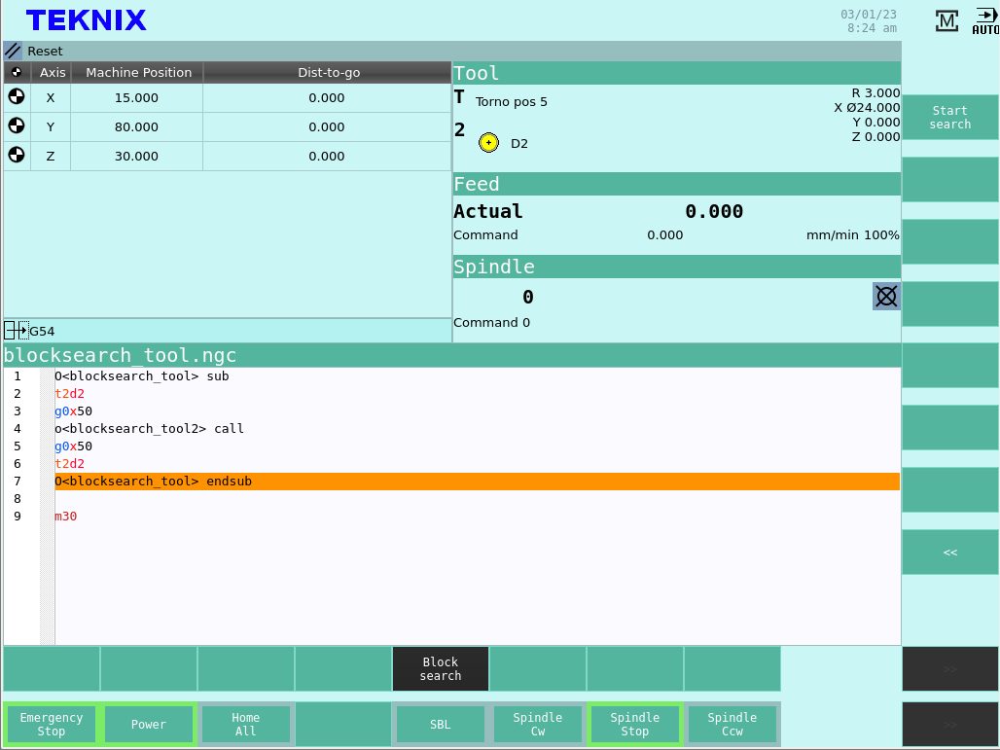

Interfaz de Usuario
###################
      
En esta sección se describen las funcionalidades y modo de operación de interfaz de usuario.
Básicamente se puede dividir a la interfaz en su pantalla táctil principal por una parte y el teclado, botones y perillas por otro.

.. _teclados:

Teclado y botones
=================

El teclado y botones configura la parte física de la interfaz de usuario. En su versión usual, el control cuenta con los siguientes elementos.

**Botón de emergencia**

El botón de emergencia está ubicado en una posición accesible para el operador. En caso de una emergencia se deberá presionar el botón, lo que hará
que el control numérico frene lo más rápido posible el husillo y el movimiento de la máquina. En caso de emergencia todas las funciones que se manejen por el 
PLC (Controlador Lógico Programable) de la máquina pueden ser llevadas al modo de seguridad con el que se configuren.
Para desactivar el accionamiento del botón de emergencia el operador debe girarlo, lo que hará que salga de su posición retraída. 
Desactivar el botón de emergencia no sacará a la máquina del estado de emergencia ni iniciará el giro del husillo o del movimiento.
Luego de la activación de la emergencia no es necesario realizar el referenciado de los ejes nuevamente.

.. figure:: images/emergencyButton.png
   :width: 150
   
   Botón de parada de emergencia

**Rueda para Jogging**

.. figure:: images/joggingWheel.png
   :width: 150
   
   Botón de parada de emergencia

**Selector de escala**

.. figure:: images/scaleSelector.png
   :width: 90
   
   Selector de escala

**Selecctor de eje**

.. figure:: images/axisSelector.png
   :width: 110
   
   Selector de escala

**Perillas de Override**

Pantalla Táctil
===============

La pantalla táctil brinda las funcionalidades de manejo y edición de archivos; visualización del estado de máquina; editor de decalajes,
incluido un gestor de herramientas; e ingreso de código G manual directo, entre otras. Cada funcionalidad y modo de operación se decribe 
en las siguientes secciones.

.. _pantallaMaquina:

Pantallas de Máquina
====================

.. figure:: images/HMIscreenMachine.png
   :width: 750
   
   Pantalla principal de máquina

   
   Pantalla principal de máquina, códigos activos

.. figure:: images/HMIscreenSetWorkOffset.png
   :width: 750
   
   Edición de decalajes de sistemas coordenados

.. figure:: images/HMIscreenMenu.png
   :width: 750
   
   Menu principal

   
   
   .. _HMIoffset:

Pantalla de Decalajes
=====================

**Editor de herramientas**

   
   Desgaste de herramientas

   
   Almacén de herramientas

.. figure:: images/HMIuserVariable.png
   :width: 750
   
   Variables de usuario

**Decalajes de sistemas coordenados**

.. figure:: images/HMIworkOffset.png
   :width: 750
   
   Decalajes de sistemas coordenados

**Variables de usuario**

.. figure:: images/HMIscreenMenu.png
   :width: 750
   
   Variables de usuario

.. _editProgramas:

Editor de Programas
===================

en donde se abren, editan los archivos de código G 

.. figure:: images/HMIscreenEditor.png
   :width: 750
   
   Listado de achivos

.. figure:: images/HMIscreenEditorOpenedFile.png
   :width: 750
   
   Editor de achivos

   
   Editor de achivos, selección de líneas

.. _diagnostico:

Diagnóstico
===========

   
   Pantalla de diagnóstico

Jogging
=======

Referenciado
============

Ingreso Manual Directo
======================

.. figure:: images/HMImanualDirectInput.png
   :width: 750
   
   Pantalla para ingreso manual directo

Modo Automático
===============

.. figure:: images/HMIautomatic.png
   :width: 750
   
   Pantalla en modo de ejecución automático

Búsqueda de Línea
-----------------

   
   Búsqueda de línea, solicitud para ejecutar

