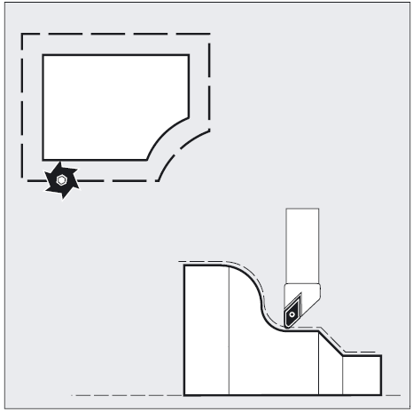
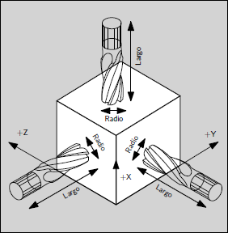
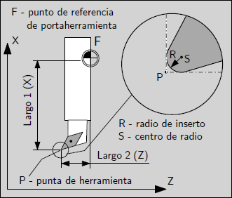
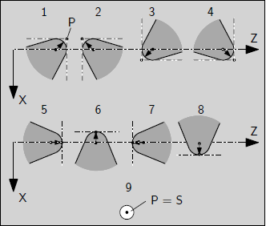
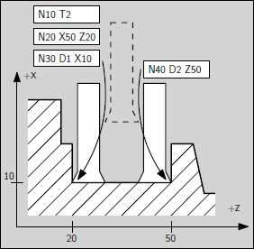
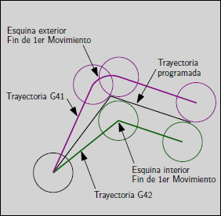
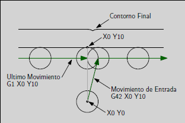

Compensación de Herramientas
############################

Generalidades
=============

Al escribir un programa de control numérico no es necesario tener en cuenta las dimensiones de las herramientas a los efectos 
compensarlas en cada línea de movimiento. Se puede programar según el contorno de la pieza a mecanizar de acuerdo al plano
de producción y hacer que el control numérico haga los cálculos para desplazar la herramienta según sus dimensiones. De esta forma 
se puede programar según el contorno de la pieza y en caso de cambiar utilizar una herramienta con otro radio por ejemplo, 
utilizar el mismo código. La posición real de las herramientas dependerá no solo de sus dimesiones sinó de la dirección en la que se realiza el movimiento.

   
   Compensación de dimensiones de herramientas
   a) Fresado (superior)
   b) Torneado (inferior)

Para que el control pueda realizar las correcciones es necesario especificar las dimensiones, además de especificar el tipo de herramienta que se trata.

Dimensiones para Fresado
------------------------

Las dimensiones que son necesarias especificar en operaciones de fresado son el radio y el largo de la herramienta.

.. figure:: images/machiningToolPositions.png
   :width: 300
   
   Dimensiones de herramienta de Fresado

**Interpretación según el plano de trabajo**

Según el plano de trabajo activo el radio y el largo se utilizan para corregir la posición de cada eje.

   
   Dimensiones de herramienta según plano de trabajo

Por ejemplo si está activo el comando *G17* es decir el plano de trabajo es el XY, el largo de herramienta se utiliza para corregir
la posición del eje Z y el radio se utiliza para corregir la posición según los ejes X e Y.

Dimensiones para Torneado
-------------------------

En operaciones de torneado se especifican dos valores de largo de herramienta, normalmente el Largo 1 según el eje X y el Largo 2 según el eje Z.
Estas dimensiones se toman desde el punto de referencia del porta herramienta hasta la punta de la herramienta, P (notar que el punto P se encuentra 
físicamente fuera del inserto), lo que se muestra en la siguiente figura.

   
   Herramienta de Torneado

Además, para que el control pueda realizar las correcciones se especifican el radio del inserto y la orientación de la
herramienta, según la numeración que se muestra en la siguiente figura.

   
   Posiciones de herramienta de Torneado

Filos de Herramientas
---------------------

Una misma herramienta puede tener más de un inserto o filo por ejemplo para mecanizar dos frentes opuestos. Para definir la posición de cada filo
se utiliza la letra *D*.

   
   Filos de Herramienta

En el ejemplo de la figura para programar se podrá utilizar las coordenadas del contorno de la pieza y para mecanizar el frente de la izquierda especificar 
el uso de la herramienta 1 con el filo 1 *T1 D1* y luego para mecanizar el frente de la derecha especificar la misma herramienta pero con el filo 2 *T1 D2*.

.. _refCutterCompensation:

Efecto en la trayectoria
------------------------

La compensación de herramienta permite programar los movimientos sin saber de antemano las dimensiones exactas de la herramienta. La única salvedad
a tener en cuenta es que para que la compensación tenga efecto luego de activarla, el primer movimiento debe ser de un largo de por lo menos el radio mayor de las
herramientas que se utilizarán.

Existen dos posibilidades en la trayectoria que seguirá la herramienta mientras la compensación está activa, que esté a la izquierda (*G41*) o que está a la derecha 
(*G42*) de trayectoria programada, mirándolo en la dirección de avance.

Además, la trayectoria depende del siguiente movimiento, si el próximo movimiento hace que el punto al que se llega forme una esquina *exterior*, entonces
el movimiento se extenderá hasta la posición del próximo movimiento teniendo en cuenta la compensación. En este caso el controlador genera un arco de círculo entre
el desplazamiento actual y el siguiente. En el caso de que se forme una esquina *interior* el movimiento actual debe ser más corto que el que especifica el punto
programado, para tener en cuenta la compensación en el próximo movimiento y no mecanizar dentro del contorno. En este caso no es necesario que el controlador genere
un movimiento intermedio. La próxima figura muestra cómo se ejecuta la compensación de herramienta en los dos casos.

   
   Efecto en la trayectoria de la compensación de herramienta

**Tabla de Herramientas**

La compensación de herramientas utiliza los datos guardados en la tabla de herramientas cuando los necesita. Estos datos pueden ser modificados en el momento de la 
ejecución del programa por ejemplo, con el comando *G10 L1*.

**Movimientos de entrada**

Cualquier movimiento que sea más largo que el radio de la herramienta servirá como movimiento de entrada. Puede ser un movimiento rápido sobre la pieza.
Si se ejecutan varios movimientos rápidos luego de activar la compensación *G41/G42* solo el último de éstos moverá a la posición definida teniendo en 
cuenta la compensación.

En la próxima figura se puede ver que el movimiento de entrada se compensa a la derecha de la trayectoria. Esto hace que que el centro de la herramienta
quede a la derecha del primer punto del contorno. Si se programa el mecanizado del contorno y se utiliza como punto final este mismo punto, el contorno quedará 
con una prominencia debido a la compensación en el punto de entrada.

   
   Prominencia en el punto de entrada

**Cambio de la dirección de compensación**

Es posible cambiar de *G41* a *G42* o viceversa sin un *G40* intermedio.
